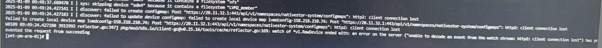
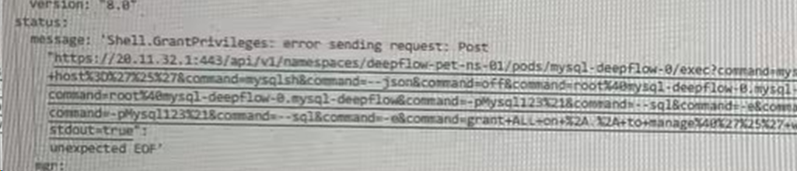
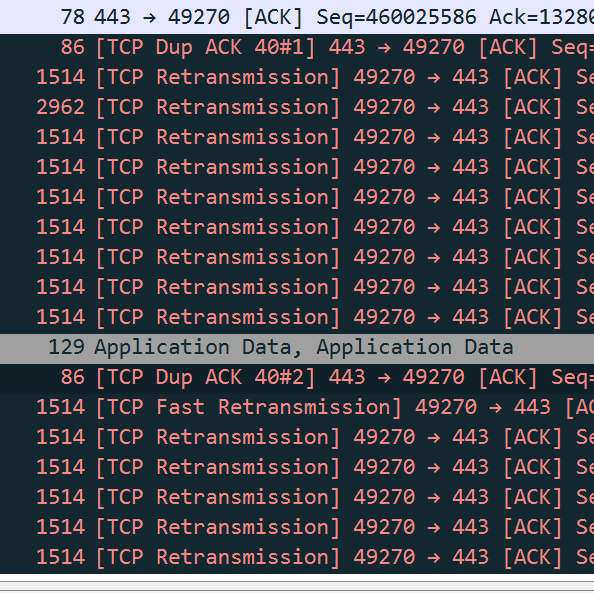
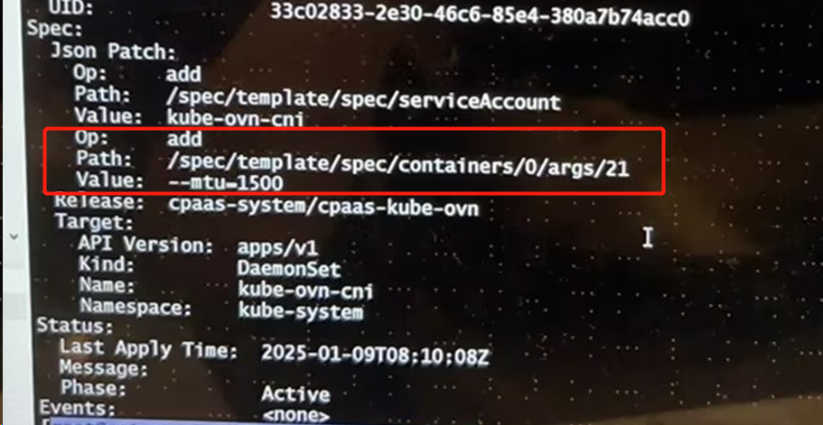

---
kind:
  - Troubleshooting
products:
  - Alauda Container Platform
  - Alauda DevOps
  - Alauda AI
  - Alauda Application Services
  - Alauda Service Mesh
  - Alauda Developer Portal
ProductsVersion:
  - 4.1.0,4.2.x
---
<!-- A type of document that involves encountering a fault, diagnosing it, performing root cause analysis, and providing solutions. -->

# http2 client connection lost / unexpected EOF

Overlay Pod 访问 API Server 出现 http2 client connection lost 以及 unexpected EOF Prometheus 监控异常，使用 CURL 查询数据时卡死 抓包发现大量重传(size > 1500 的大包)

## Cause
- 用户修改了 MTU 配置导致大包传输异常

## Resolution
- 将 kube-ovn-cni 参数还原
- 重建受影响的 overlay Pod

## [workaround]

## [Related Information]
**Screenshots**

- kube-ovn-cni
- MTU
- Overlay Pod
- API Server
- Component: Prometheus
- Page ID: 257263522
- Original Title: http2 client connection lost / unexpected EOF
