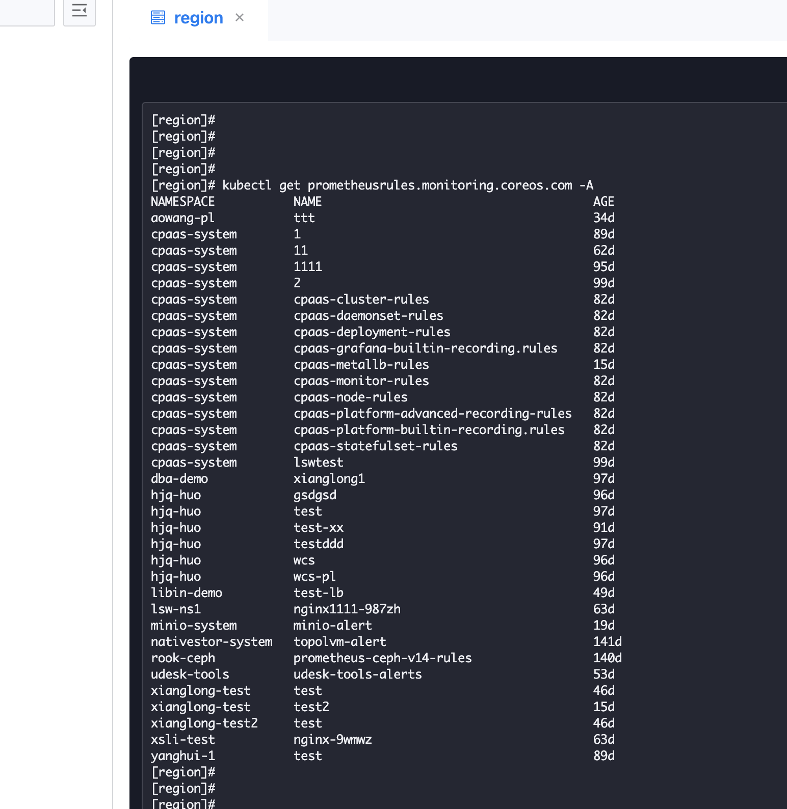

---
kind:
  - Troubleshooting
products:
  - Alauda Container Platform
  - Alauda DevOps
  - Alauda AI
  - Alauda Application Services
  - Alauda Service Mesh
  - Alauda Developer Portal
ProductsVersion:
  - 4.1.0,4.2.x
---
<!-- A type of document that involves encountering a fault, diagnosing it, performing root cause analysis, and providing solutions. -->

# 集群告警策略对应哪个资源，是否可以通过kubectl进行创建

JIRA Jira：

## Cause
- 告警策略由Prometheus Operator管理的PrometheusRule CRD实现

## Resolution
- 使用kubectl get/apply/delete prometheusrules进行管理
- 创建符合PrometheusRule规范的YAML文件

## [workaround]

## [Related Information]
**Screenshots**

- PrometheusRule
- Prometheus Operator
- monitoring
- Component: Prometheus
- Page ID: 311558522
- Original Title: 基础架构-集群告警策略对应哪个资源，是否可以通过kubectl进行创建-110422-zh
