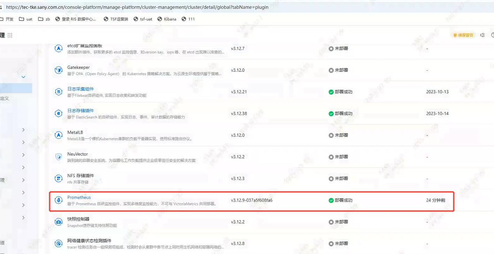
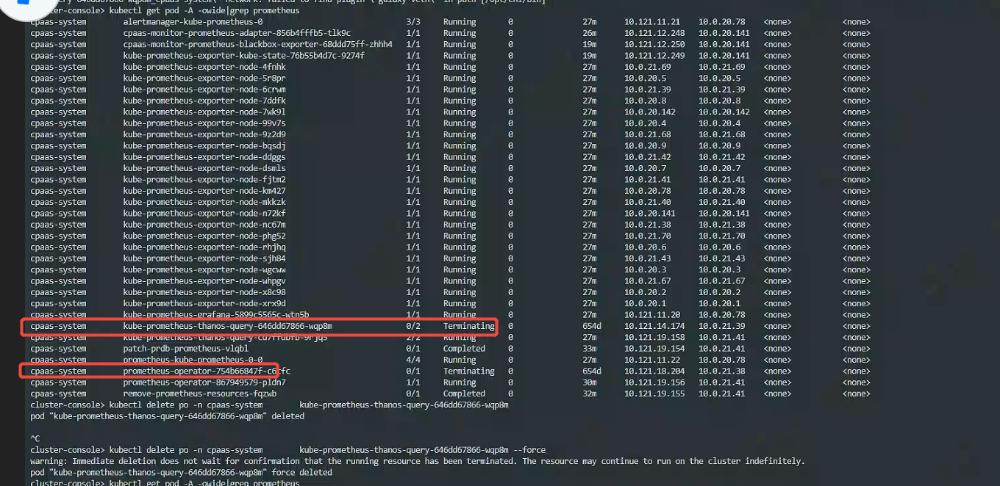

---
kind:
  - Troubleshooting
products:
  - Alauda Container Platform
  - Alauda DevOps
  - Alauda AI
  - Alauda Application Services
  - Alauda Service Mesh
  - Alauda Developer Portal
ProductsVersion:
  - 4.1.0,4.2.x
---
<!-- A type of document that involves encountering a fault, diagnosing it, performing root cause analysis, and providing solutions. -->

# 部署监控插件问题

grafana访问失败 自定义grafana面板被删除 实时告警提示prometheus pod状态异常

## Cause
- 未备份grafana目录数据导致访问失败
- 旧prometheus-thanos/prometheus-operator pod未正常终止

## Resolution
- 部署前备份1、2节点grafana目录数据
- 手动删除prometheus-thanos和prometheus-operator异常pod

## [workaround]

## [Related Information]
**Screenshots**

- /grafana目录
- prometheusrule
- prometheus-thanos
- prometheus-operator
- Component: Prometheus
- Page ID: 324173971
- Original Title: 基础架构-插件-部署监控插件问题
