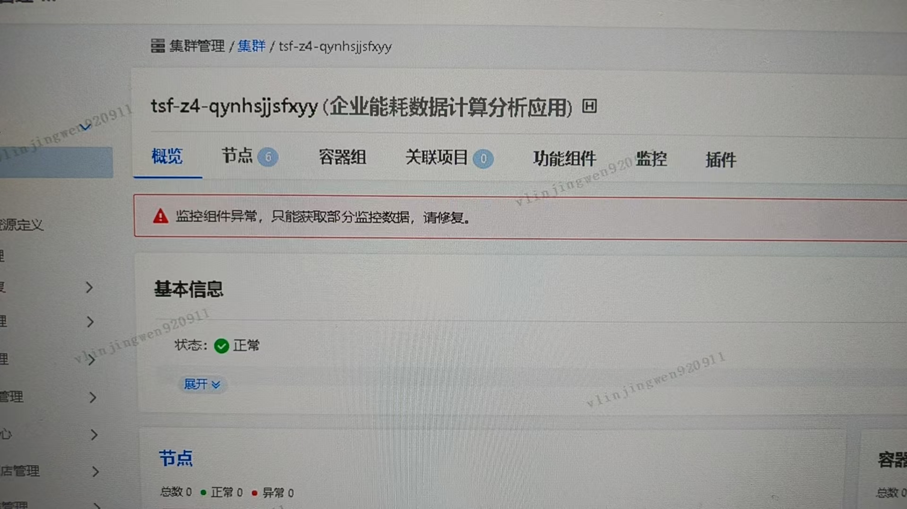
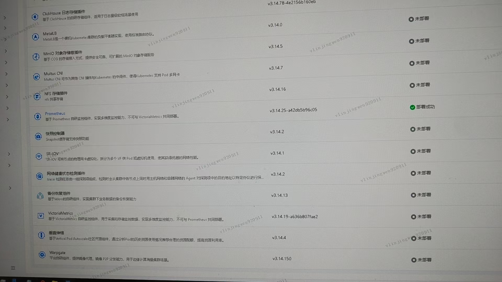
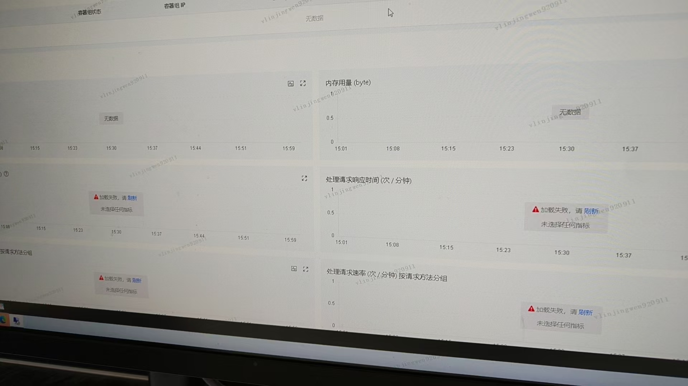
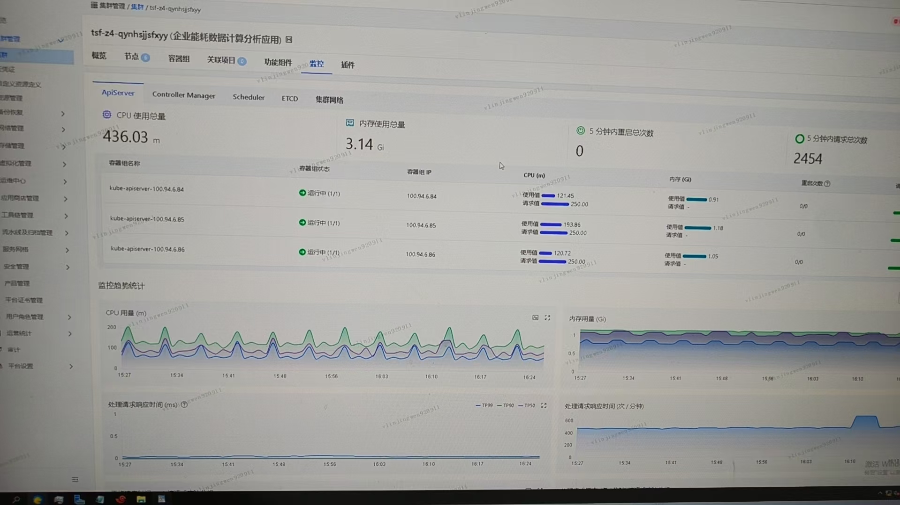

---
kind:
  - Troubleshooting
products:
  - Alauda Container Platform
  - Alauda DevOps
  - Alauda AI
  - Alauda Application Services
  - Alauda Service Mesh
  - Alauda Developer Portal
ProductsVersion:
  - 4.1.0,4.2.x
---
<!-- A type of document that involves encountering a fault, diagnosing it, performing root cause analysis, and providing solutions. -->

# tke集群的监控安装显示Prometheus异常

Prometheus显示异常 Prometheus Pod状态正常 Apollo日志存在异常记录

## Cause
- Apollo组件异常导致Prometheus配置加载问题

## Resolution
- 重启Apollo组件后恢复正常

## [workaround]

## [Related Information]
**Screenshots**

- Environment: TKE集群 3.14.2版本
- Apollo
- Prometheus Pod
- Component: Prometheus
- Page ID: 327812004
- Original Title: 基础架构-tke集群的监控安装显示Prometheus异常-114541
