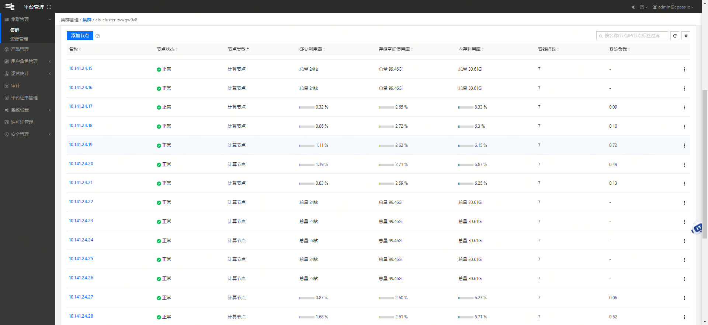
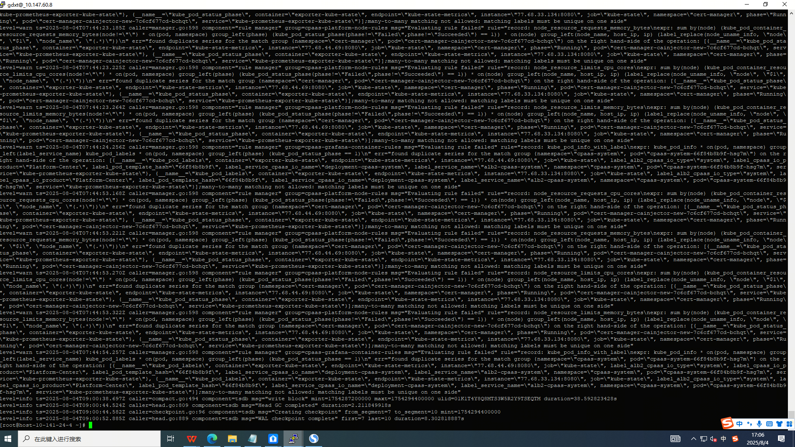
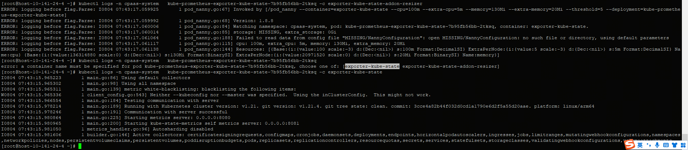
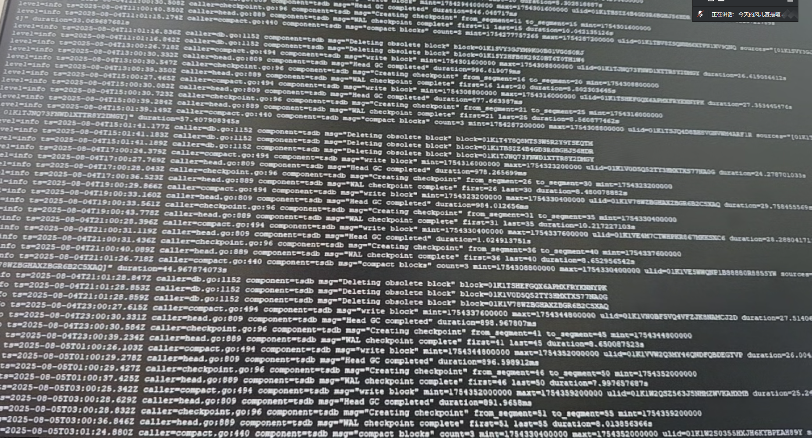

---
kind:
  - Troubleshooting
products:
  - Alauda Container Platform
  - Alauda DevOps
  - Alauda AI
  - Alauda Application Services
  - Alauda Service Mesh
  - Alauda Developer Portal
ProductsVersion:
  - 4.1.0,4.2.x
---
<!-- A type of document that involves encountering a fault, diagnosing it, performing root cause analysis, and providing solutions. -->

# TKE Prometheus数据异常

监控数据时有时无 每隔5个节点数据采集异常 Prometheus日志显示查询超时

## Cause
- Prometheus压力较大导致查询超时

## Resolution
- 扩展Prometheus的request及limit资源限制
- 重启Apollo服务

## [workaround]

## [Related Information]
**Screenshots**

- Environment: 3.6.4
- Prometheus
- Apollo
- request/limit配置
- Component: Prometheus
- Page ID: 330466203
- Original Title: 基础架构-运维中心-监控告警通知巡检-TKE Prometheus数据异常-114352
