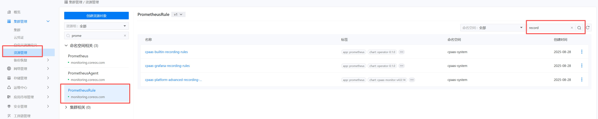
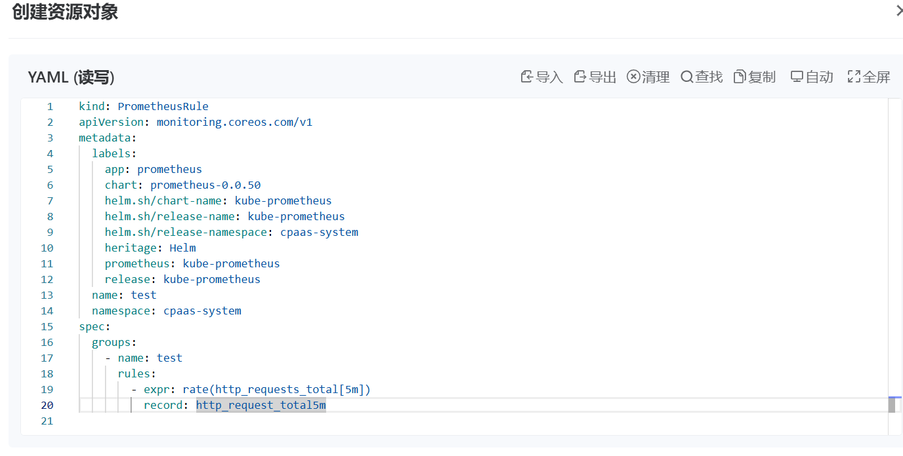

---
kind:
  - Troubleshooting
products:
  - Alauda Container Platform
  - Alauda DevOps
  - Alauda AI
  - Alauda Application Services
  - Alauda Service Mesh
  - Alauda Developer Portal
ProductsVersion:
  - 4.1.0,4.2.x
---
<!-- A type of document that involves encountering a fault, diagnosing it, performing root cause analysis, and providing solutions. -->

# 基于现有prometheus指标，自己组合原有表达式生成新指标后再写入prometheus该如何操作

JIRA Jira：

## Cause

## Resolution
- 在资源管理界面创建新的PrometheusRule资源对象，参考现有规则格式定义record字段生成新指标

## [workaround]

## [Related Information]
**Screenshots**

- Environment: 3.16.2
- prometheusrule
- record
- Component: Prometheus
- Page ID: 345538890
- Original Title: 基础架构-基于现有prometheus指标，自己组合原有表达式生成新指标后再写入prometheus该如何操作-117181
