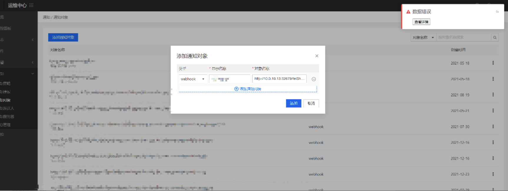
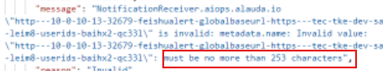

---
kind:
  - Troubleshooting
products:
  - Alauda Container Platform
  - Alauda DevOps
  - Alauda AI
  - Alauda Application Services
  - Alauda Service Mesh
  - Alauda Developer Portal
ProductsVersion:
  - 4.1.0,4.2.x
---
<!-- A type of document that involves encountering a fault, diagnosing it, performing root cause analysis, and providing solutions. -->

# 创建webhook通知对象失败

创建webhook通知对象界面报错数据错误 告警链接长度超过253字符

## Cause
- 告警链接长度286字符超过最大限制253字符

## Resolution
- 缩减告警链接字符长度至253字符以内

## [workaround]

## [Related Information]
**Screenshots**

- Environment: 3.4.2
- webhook通知配置
- 告警链接参数
- Component: Webhook
- Page ID: 112061978
- Original Title: 创建webhook通知对象失败
