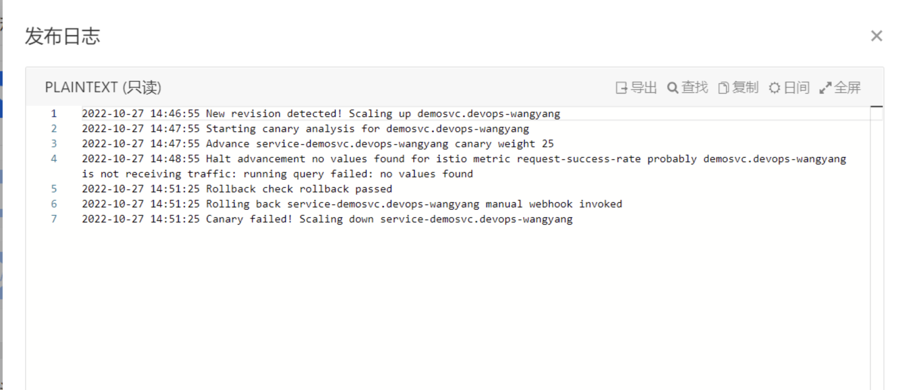

---
kind:
  - Troubleshooting
products:
  - Alauda Container Platform
  - Alauda DevOps
  - Alauda AI
  - Alauda Application Services
  - Alauda Service Mesh
  - Alauda Developer Portal
ProductsVersion:
  - 4.1.0,4.2.x
---
<!-- A type of document that involves encountering a fault, diagnosing it, performing root cause analysis, and providing solutions. -->

# asm灰度发布异常

Canary failed! Scaling down service-demosvc.devops-wangyang 网关添加服务路由异常提示webhook证书异常

## Cause
- asm-controller-webhook的validatingwebhookconfigurations使用废弃的自签名证书
- asm-operator版本与正常集群不一致
- installplan的approval配置为false导致未自动升级

## Resolution
- 修改validatingwebhookconfigurations的annotation改用cert-manager
- 手动修改installplan的approval为true触发ASM版本升级

## [workaround]

## [Related Information]
**Screenshots**

- Environment: TKE 3.6
- validatingwebhookconfigurations
- cert-manager
- asm-operator
- ClusterServiceVersion(CSV)
- installplan
- approval配置键
- Component: Webhook
- Page ID: 133081999
- Original Title: asm灰度发布异常
