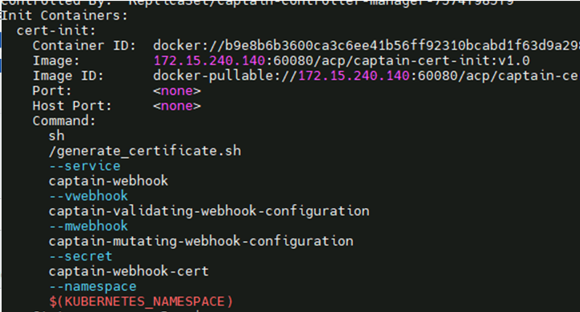
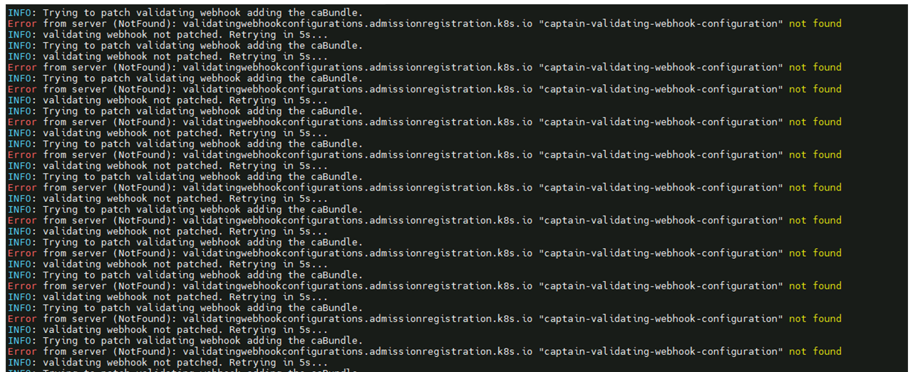

---
kind:
  - Troubleshooting
products:
  - Alauda Container Platform
  - Alauda DevOps
  - Alauda AI
  - Alauda Application Services
  - Alauda Service Mesh
  - Alauda Developer Portal
ProductsVersion:
  - 4.1.0,4.2.x
---
<!-- A type of document that involves encountering a fault, diagnosing it, performing root cause analysis, and providing solutions. -->

# 3.0.5

captain组件一直卡在init初始化 组件事件显示找不到webhook资源 mutatingwebhookconfigurations和validatingwebhookconfigurations中无captain对应的webhook

## Cause
- secret内证书更新后未正确重建webhook资源

## Resolution
- 备份并删除captain组件的deploy资源
- 修改platform ars资源添加变量触发更新

## [workaround]

## [Related Information]
**Screenshots**

- Environment: 3.0.5
- secret
- deploy
- mutatingwebhookconfigurations
- validatingwebhookconfigurations
- platform ars资源
- Component: Webhook
- Page ID: 152633846
- Original Title: 3.0.5-基础架构-captain证书过期更换后组件无法正常运行
