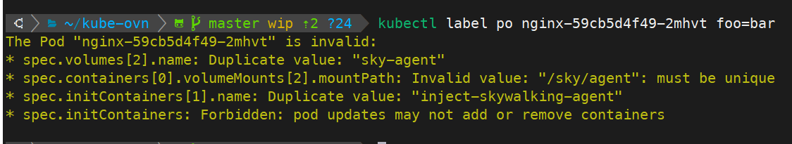
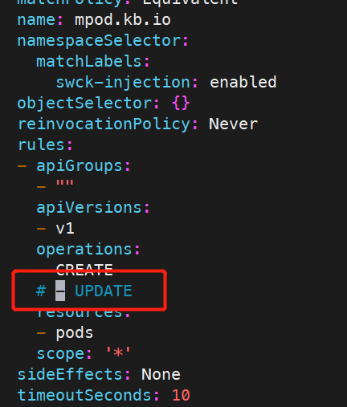

---
kind:
  - Troubleshooting
products:
  - Alauda Container Platform
  - Alauda DevOps
  - Alauda AI
  - Alauda Application Services
  - Alauda Service Mesh
  - Alauda Developer Portal
ProductsVersion:
  - 4.1.0,4.2.x
---
<!-- A type of document that involves encountering a fault, diagnosing it, performing root cause analysis, and providing solutions. -->

# 通过 webhook 的方式对 pod 进行注入后，pod 无法正常启动

pod无法正常启动 kube-ovn-controller在patch pod时失败，报错pod yaml invalid

## Cause
- skywalking swck的webhook同时注册了pod CREATE和UPDATE事件导致重复注入同名initContainer/volume

## Resolution
- kubectl edit MutatingWebhookConfiguration skywalking-swck-mutating-webhook-configuration 删除pods规则中的UPDATE事件
- 升级swck至>=0.9版本

## [workaround]

## [Related Information]
**Screenshots**

- Environment: Kubernetes with kube-ovn v1.8 CNI
- kube-ovn-controller
- MutatingWebhookConfiguration
- skywalking-swck-mutating-webhook-configuration
- initContainer
- volume
- Component: Webhook
- Page ID: 195494232
- Original Title: 通过 webhook 的方式对 pod 进行注入后，pod 无法正常启动
