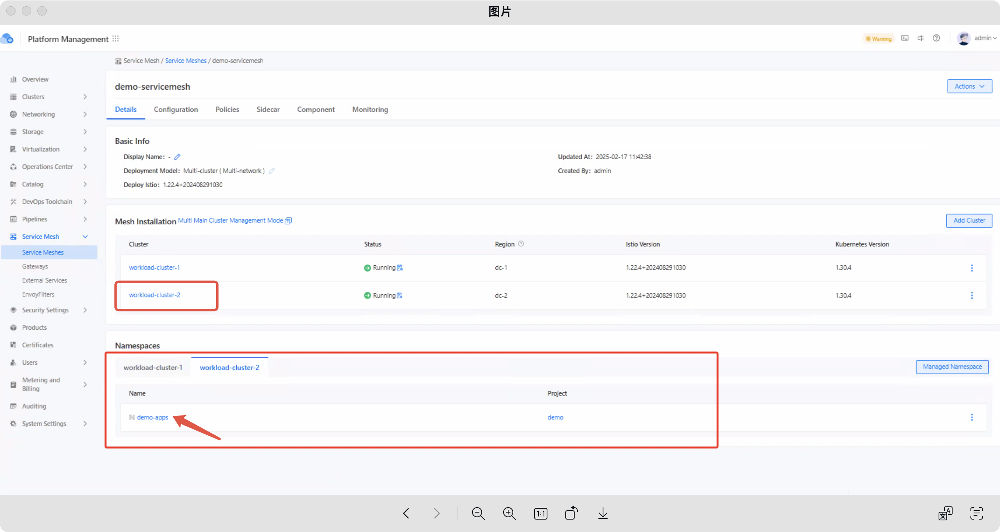
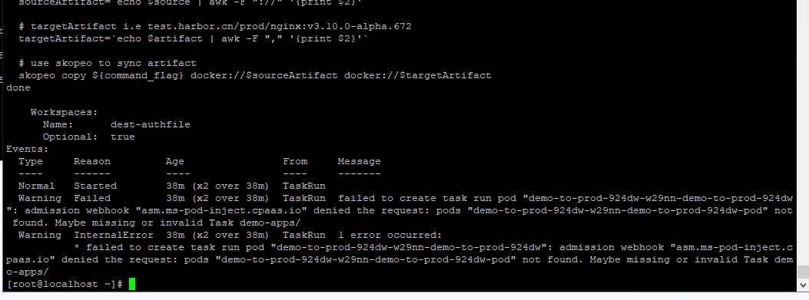

---
kind:
  - Troubleshooting
products:
  - Alauda Container Platform
  - Alauda DevOps
  - Alauda AI
  - Alauda Application Services
  - Alauda Service Mesh
  - Alauda Developer Portal
ProductsVersion:
  - 4.1.0,4.2.x
---
<!-- A type of document that involves encountering a fault, diagnosing it, performing root cause analysis, and providing solutions. -->

# 制品晋级执行后一直处于运行状态

制品晋级执行后一直处于运行中

## Cause
- 制品晋级目标名称空间与ASM网格所在名称空间相同，导致sidecar注入冲突

## Resolution
- 避免ASM网格所在名称空间与制品晋级目标名称空间处于同一个

## [workaround]

## [Related Information]
**Screenshots**

- Environment: Alauda DevOps 3.16
- ASM网格
- sidecar注入
- webhook
- 名称空间配置
- Component: Webhook
- Page ID: 268535868
- Original Title: Devops-制品晋级执行后一直处于运行状态
