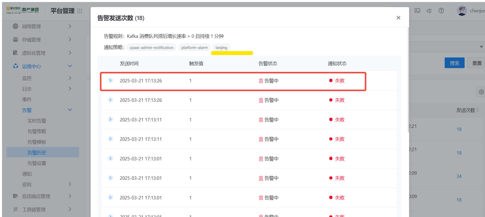
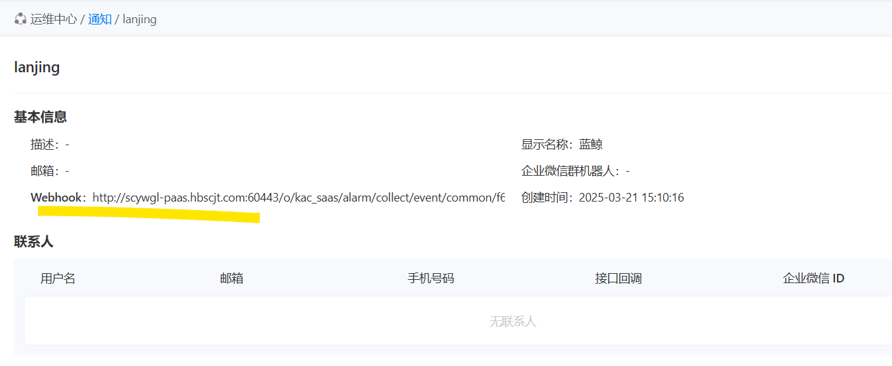

---
kind:
  - Troubleshooting
products:
  - Alauda Container Platform
  - Alauda DevOps
  - Alauda AI
  - Alauda Application Services
  - Alauda Service Mesh
  - Alauda Developer Portal
ProductsVersion:
  - 4.1.0,4.2.x
---
<!-- A type of document that involves encountering a fault, diagnosing it, performing root cause analysis, and providing solutions. -->

# 配置了通知webhook，接口方反映没收到

webhook通知失败，接口方未收到通知 courier日志中无相关webhook调用记录 配置的webhook地址为http协议但实际请求使用https协议

## Cause
- 3.16.1版本存在bug：webhook地址配置http协议时会被错误拼接为https协议

## Resolution
- 升级到3.16.2版本获得修复
- 将webhook地址改为https协议格式

## [workaround]
- 临时使用https协议的webhook地址进行配置

## [Related Information]
**Screenshots**

- Environment: 3.16.1
- courier服务
- webhook配置地址字段
- http://scywgl-paas.hbscjt.com:60443
- https://scywgl-paas.hbscjt.com
- Component: Webhook
- Page ID: 272236751
- Original Title: 基础架构-运维中心-监控告警通知巡检-配置了通知webhook，接口方反映没收到-103693
