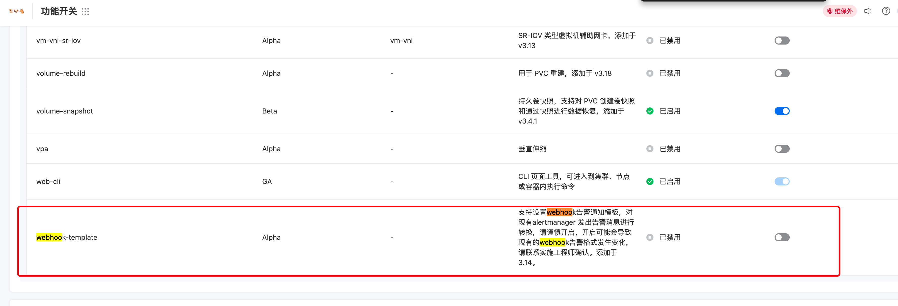
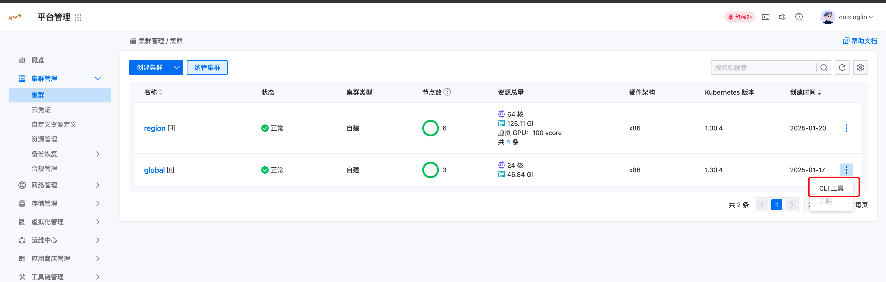
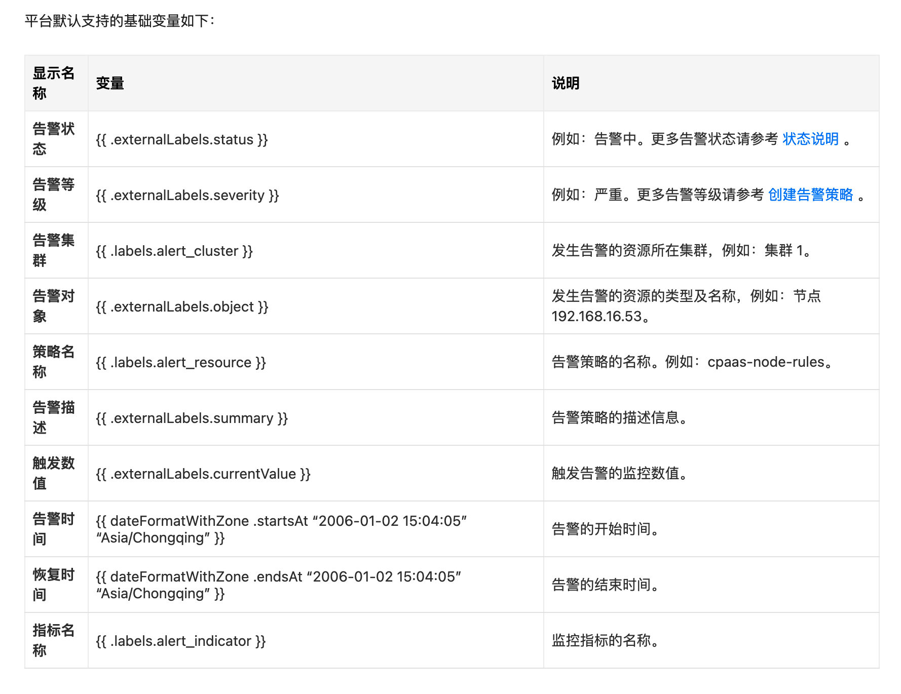

---
kind:
  - Troubleshooting
products:
  - Alauda Container Platform
  - Alauda DevOps
  - Alauda AI
  - Alauda Application Services
  - Alauda Service Mesh
  - Alauda Developer Portal
ProductsVersion:
  - 4.1.0,4.2.x
---
<!-- A type of document that involves encountering a fault, diagnosing it, performing root cause analysis, and providing solutions. -->

# 对接蓝鲸告警

平台默认告警模版字段与蓝鲸平台定义字段不匹配 通知策略未正确配置导致告警无法推送

## Cause
- 默认告警模版未按蓝鲸平台字段规范定义
- 告警级别映射关系不一致（平台4级 vs 蓝鲸3级）

## Resolution
- 开启webhook功能：kubectl patch secret -n cpaas-system platform-webhook-server -p '{"data":{"enable":"dHJ1ZQo="}}'
- 创建自定义通知模版，匹配蓝鲸字段规范（包含item/name/event_id/alarm_time/content/action/level/object字段）
- 配置告警级别映射：Critical→level3，High→level2，其他→level1
- 创建通知联系组并配置蓝鲸webhook地址
- 创建通知策略关联自定义模版和联系组

## [workaround]

## [Related Information]
**Screenshots**

- Environment: 通用
- platform管理/运维中心/通知模版
- platform-webhook-server
- labels.severity
- externalLabels.object
- text/template语法
- Component: Webhook
- Page ID: 282656914
- Original Title: 对接蓝鲸告警-自定义告警模版
