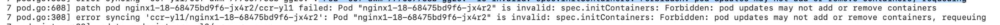

---
kind:
  - Troubleshooting
products:
  - Alauda Container Platform
  - Alauda DevOps
  - Alauda AI
  - Alauda Application Services
  - Alauda Service Mesh
  - Alauda Developer Portal
ProductsVersion:
  - 4.1.0,4.2.x
---
<!-- A type of document that involves encountering a fault, diagnosing it, performing root cause analysis, and providing solutions. -->

# Kube

Pod 漂移至其他节点后无法启动 Pod 事件显示 'Failed to create pod sandbox...request ip return 500 no address allocated to pod...' ovn-controller 日志报错 'Forbidden: pod updates may not add or remove containers'

## Cause
- 客户侧单实例 webhook 服务关闭导致新建 Pod 缺失 initContainers
- ovn-controller 尝试动态修改 Pod 的 initContainers 但被 Kubernetes API 拒绝
- Kubernetes API 限制 initContainers 字段不可变
- 缺少 initContainers 导致固定 IP 配置失效

## Resolution
- 确保 webhook 服务高可用（多实例部署、负载均衡）
- 删除并重建问题 Pod：kubectl delete pod <podname>

## [workaround]

## [Related Information]
**Screenshots**
* 
- Environment: 通用
- kube-ovn-controller
- initContainers
- webhook 服务
- Kubernetes API Server
- Component: Webhook
- Page ID: 332038340
- Original Title: 容器平台-网络-Kube-OVN-客户侧自建webhook注入initContainers 的固定IP服务Pod 漂移后无法启动问题排查-115279
