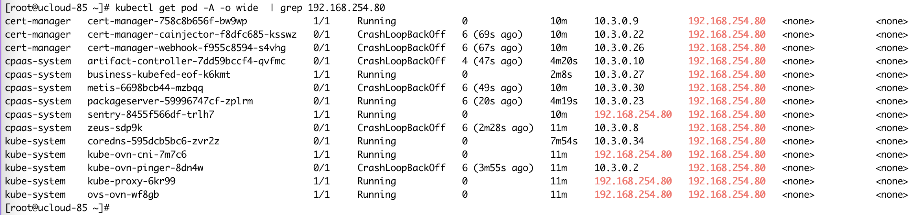
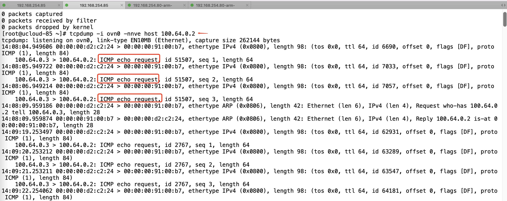
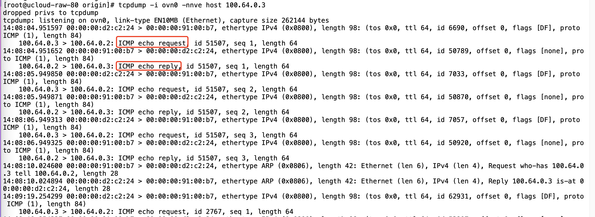
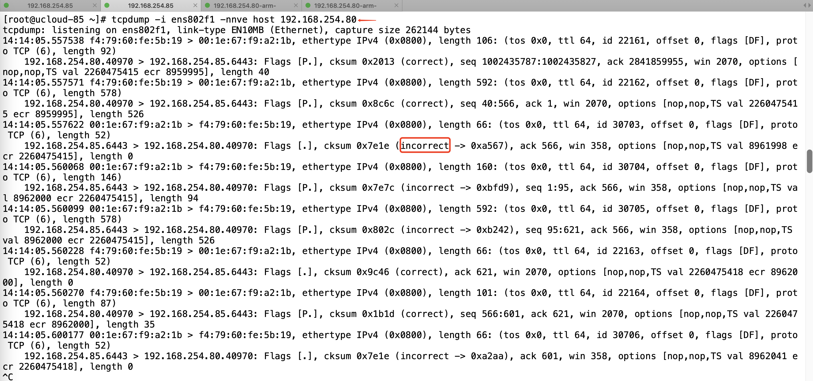

---
kind:
  - Troubleshooting
products:
  - Alauda Container Platform
  - Alauda DevOps
  - Alauda AI
  - Alauda Application Services
  - Alauda Service Mesh
  - Alauda Developer Portal
ProductsVersion:
  - 4.1.0,4.2.x
---
<!-- A type of document that involves encountering a fault, diagnosing it, performing root cause analysis, and providing solutions. -->

# 异构集群，跨节点pod 访问不通

worker节点上的pod不断crash，提示访问apiserver失败 跨节点ping worker节点上的pod不通 抓包显示master节点发出的icmp包checksum incorrect，worker节点回复的reply报文未到达master

## Cause
- 异构集群环境下arm节点的物理网卡tx checksum校验导致报文校验失败

## Resolution
- 关闭arm节点物理网卡的tx checksum校验

## [workaround]

## [Related Information]
**Screenshots**

- Environment: RedHat 7.8 + kylin v10sp2混合架构集群（X86 master + ARM worker），kube-ovn v1.11.11
- kube-ovn
- ovn0网卡
- 物理网卡配置
- icmp报文校验
- Component: 异构集群
- Page ID: 170721677
- Original Title: 异构集群，跨节点pod 访问不通
