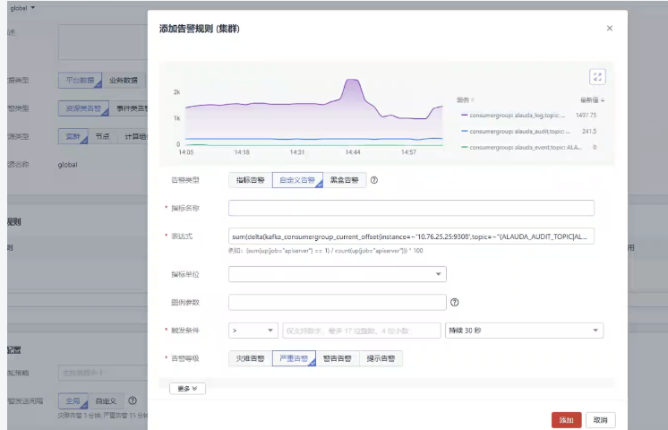
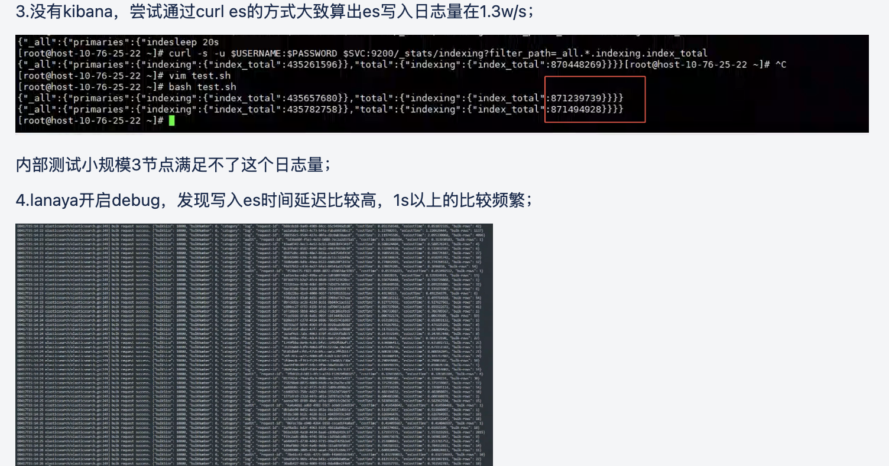
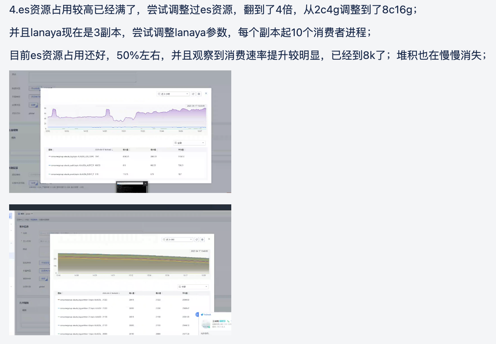
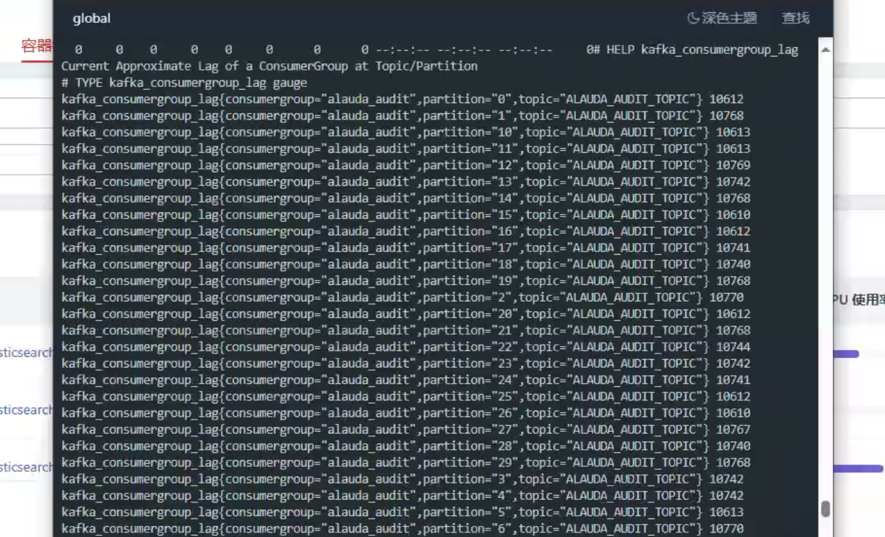
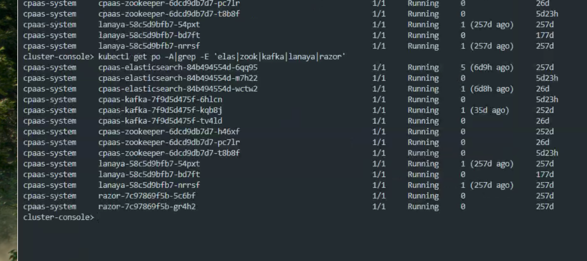
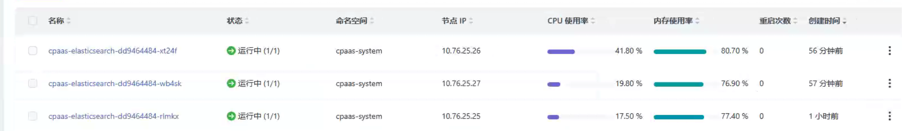
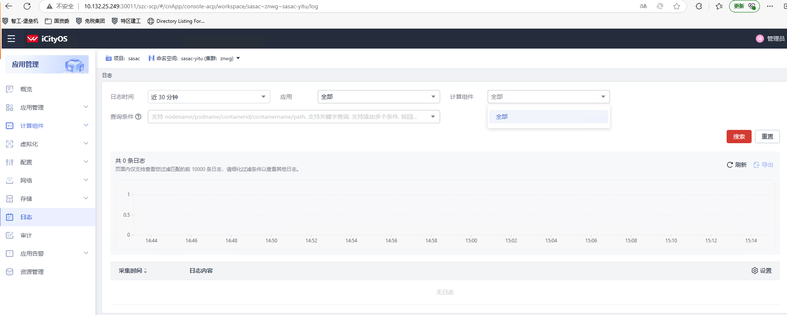

---
kind:
  - Troubleshooting
products:
  - Alauda Container Platform
  - Alauda DevOps
  - Alauda AI
  - Alauda Application Services
  - Alauda Service Mesh
  - Alauda Developer Portal
ProductsVersion:
  - 4.1.0,4.2.x
---
<!-- A type of document that involves encountering a fault, diagnosing it, performing root cause analysis, and providing solutions. -->

# 基础架构,运维中心,日志事件审计

日志查询界面未显示预期的日志内容

## Cause
- 日志索引的映射关系存在异常

## Resolution
- 重建日志索引
- 更新日志收集配置
- 验证查询功能

## [workaround]

## [Related Information]
**Screenshots**

- Environment: v3.12.0
- 日志收集组件
- 日志存储后端
- 日志索引
- 查询语法
- 用户权限
- Component: 日志事件审计
- Page ID: 285934296
- Original Title: 基础架构,运维中心,日志事件审计-日志查询无数据-105910-zh
