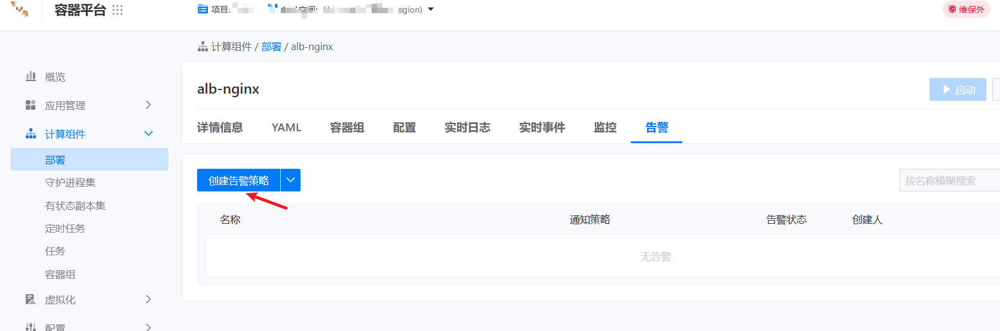
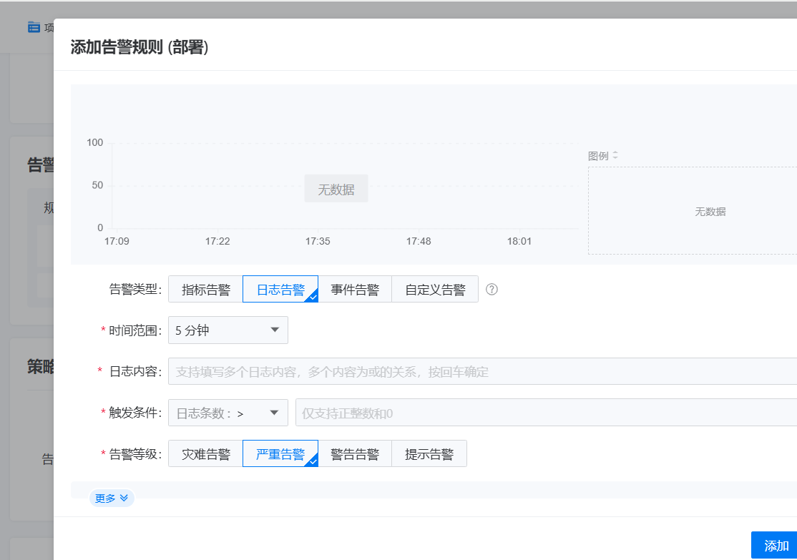

---
kind:
  - Troubleshooting
products:
  - Alauda Container Platform
  - Alauda DevOps
  - Alauda AI
  - Alauda Application Services
  - Alauda Service Mesh
  - Alauda Developer Portal
ProductsVersion:
  - 4.1.0,4.2.x
---
<!-- A type of document that involves encountering a fault, diagnosing it, performing root cause analysis, and providing solutions. -->

# 是否有如下描述功能，有的话请截图说明

JIRA Jira：

## Cause

## Resolution
- 计算组件支持日志告警功能，参考配置步骤配置

## [workaround]

## [Related Information]
**Screenshots**

- Environment: 3.18.1
- Component: 日志事件审计
- Page ID: 323289776
- Original Title: 基础架构-运维中心-日志事件审计-是否有如下描述功能，有的话请截图说明-113782
