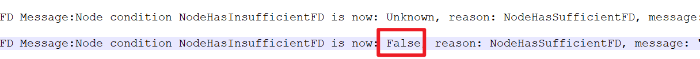

---
kind:
  - Troubleshooting
products:
  - Alauda Container Platform
  - Alauda DevOps
  - Alauda AI
  - Alauda Application Services
  - Alauda Service Mesh
  - Alauda Developer Portal
ProductsVersion:
  - 4.1.0,4.2.x
---
<!-- A type of document that involves encountering a fault, diagnosing it, performing root cause analysis, and providing solutions. -->

# nevermore组件异常重启

nevermore组件因连接API超时自动重启 node-problem-detector容器退出码137 执行/config/fdpresure-check.sh脚本失败

## Cause
- apiserver连接异常
- 文件描述符资源耗尽

## Resolution
- 检查节点到apiserver(10.0.4.1:443)网络连通性
- 使用curl -k https://10.0.4.1:443验证连接
- 检查并调整文件描述符限制

## [workaround]

## [Related Information]
**Screenshots**

- Environment: 3.14.1
- 443端口
- /config/fdpresure-check.sh
- node-problem-detector
- nevermore
- apiserver(10.0.4.1)
- Component: 日志事件审计
- Page ID: 323289854
- Original Title: 基础架构-运维中心-日志事件审计-nevermore组件异常重启-113527
