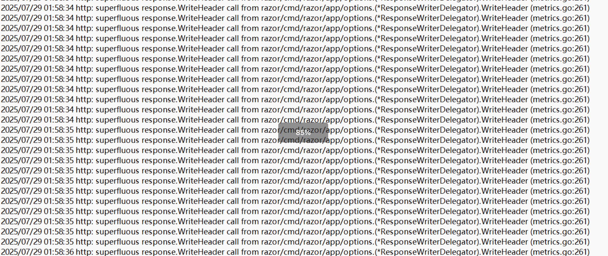
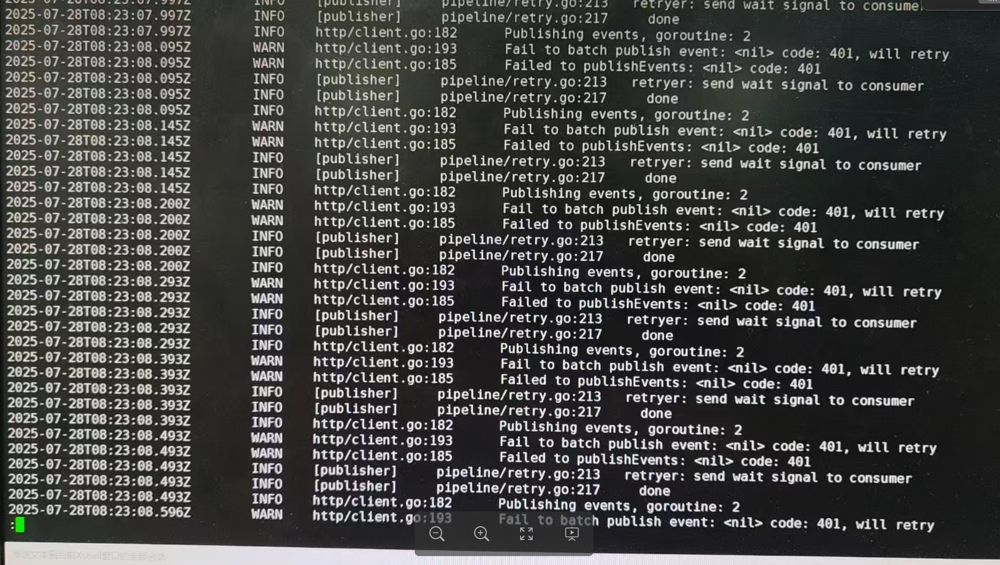

---
kind:
  - Troubleshooting
products:
  - Alauda Container Platform
  - Alauda DevOps
  - Alauda AI
  - Alauda Application Services
  - Alauda Service Mesh
  - Alauda Developer Portal
ProductsVersion:
  - 4.1.0,4.2.x
---
<!-- A type of document that involves encountering a fault, diagnosing it, performing root cause analysis, and providing solutions. -->

# 页面上，应用中事件不显示或显示得特别慢

应用中事件不显示或显示得特别慢（延迟约十几二十分钟） 业务集群的filebeat日志报错401 razor日志显示主备transformer更新token问题

## Cause
- 主备transformer都会更新razor的token，业务集群最终使用备集群下发的token导致鉴权失败

## Resolution
- 升级到3.18.0版本修复该问题
- 临时方案：在razor添加启动参数--legacy-callback=true绕过token验证

## [workaround]
- 在razor配置中添加--legacy-callback=true参数

## [Related Information]
**Screenshots**

- Environment: 3.8.3
- razor
- kafka
- ES
- filebeat
- event-exporter
- /cpaas/event/data/
- /cpaas/log/event
- Component: 日志事件审计
- Page ID: 323682797
- Original Title: 基础架构-运维中心-日志事件审计-页面上，应用中事件不显示或显示得特别慢-113845
