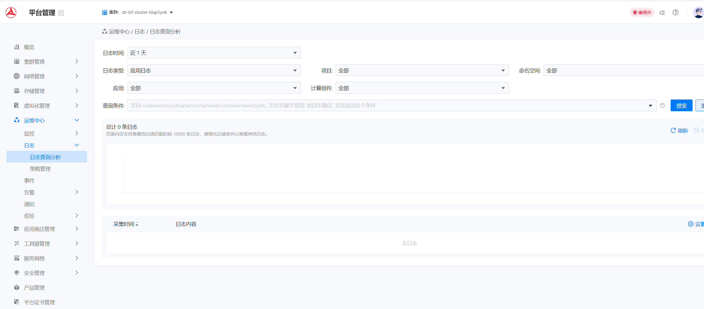
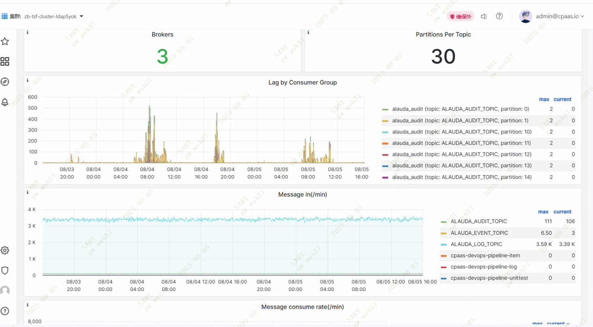
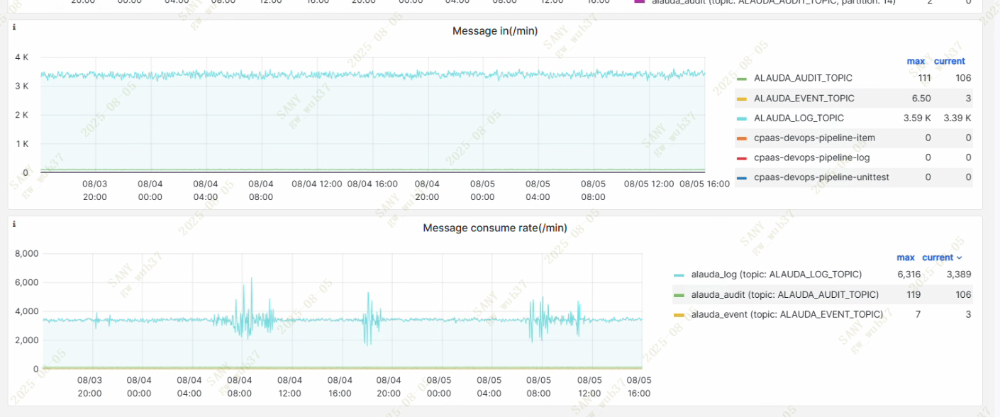
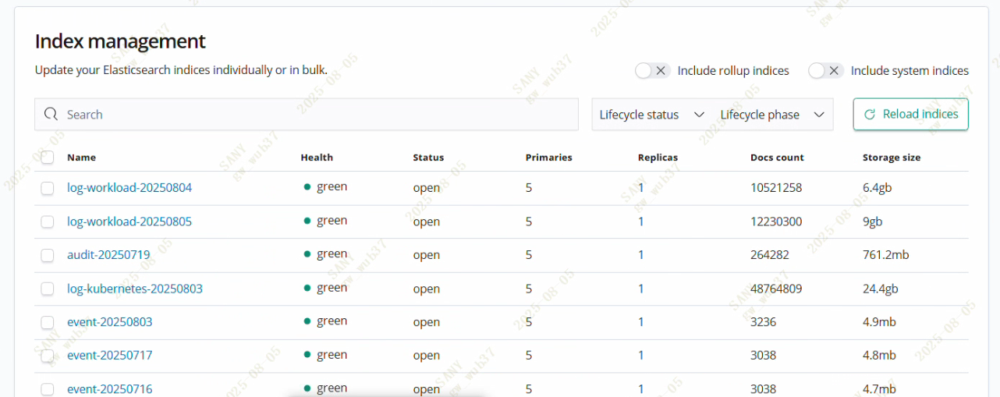
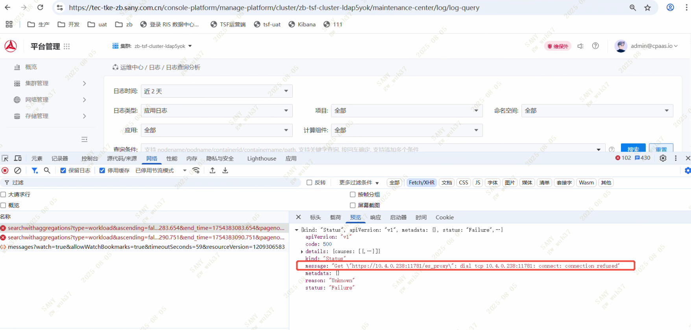
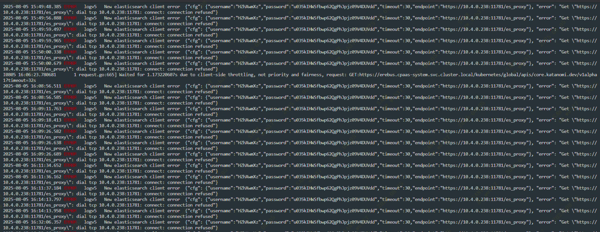

---
kind:
  - Troubleshooting
products:
  - Alauda Container Platform
  - Alauda DevOps
  - Alauda AI
  - Alauda Application Services
  - Alauda Service Mesh
  - Alauda Developer Portal
ProductsVersion:
  - 4.1.0,4.2.x
---
<!-- A type of document that involves encountering a fault, diagnosing it, performing root cause analysis, and providing solutions. -->

# 灾备环境无法查询所有日志

灾备环境无法查询所有日志 运维中心页面查询日志返回11781端口拒绝连接 apollo日志显示业务集群11781端口拒绝连接

## Cause
- 业务集群HA未转发11781端口

## Resolution
- 配置11781端口转发

## [workaround]

## [Related Information]
**Screenshots**

- Environment: 3.12.2
- 11781端口
- ES集群
- Kafka
- HA配置
- apollo日志
- Component: 日志事件审计
- Page ID: 327812150
- Original Title: 基础架构-运维中心-日志事件审计-灾备环境无法查询所有日志-114418
