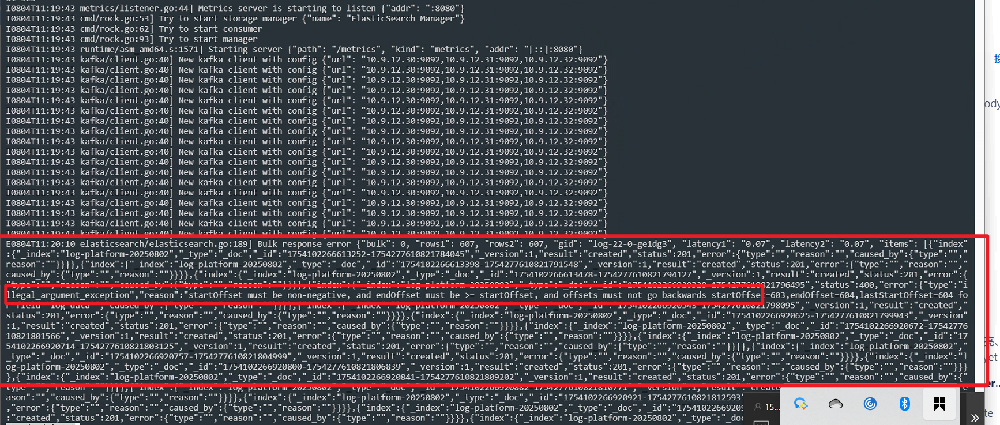

---
kind:
  - Troubleshooting
products:
  - Alauda Container Platform
  - Alauda DevOps
  - Alauda AI
  - Alauda Application Services
  - Alauda Service Mesh
  - Alauda Developer Portal
ProductsVersion:
  - 4.1.0,4.2.x
---
<!-- A type of document that involves encountering a fault, diagnosing it, performing root cause analysis, and providing solutions. -->

# 生产日志没有数据了

生产日志没有数据 kafka监控面板存在数据堆积 lanaya日志中存在ik分词器相关报错

## Cause
- 日志使用ik分词器存在部分日志无法插入
- 当前版本es组件存在bug

## Resolution
- 更换es组件hotfix镜像
- 重启lanaya服务

## [workaround]

## [Related Information]
**Screenshots**

- Environment: 3.14.0 | kubectl get pods -n cpaas-system -owide |egrep -i "elastic|kafka|zookeeper"
- elasticsearch
- kafka
- zookeeper
- lanaya
- ik分词器
- Component: 日志事件审计
- Page ID: 330465768
- Original Title: 基础架构-运维中心-日志事件审计-生产日志没有数据了-114298
