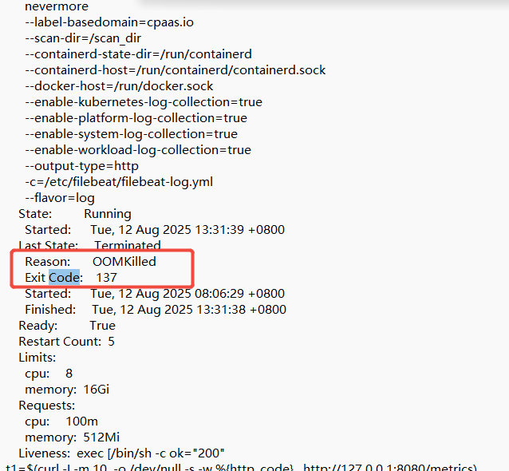

---
kind:
  - Troubleshooting
products:
  - Alauda Container Platform
  - Alauda DevOps
  - Alauda AI
  - Alauda Application Services
  - Alauda Service Mesh
  - Alauda Developer Portal
ProductsVersion:
  - 4.1.0,4.2.x
---
<!-- A type of document that involves encountering a fault, diagnosing it, performing root cause analysis, and providing solutions. -->

# 排查pod循环重启告警策略

pod循环重启 OOM错误 日志采集组件资源使用率高

## Cause
- 日志告警规则中的关键词匹配导致资源消耗过大（1w条日志匹配100条告警规则时产生高负载）

## Resolution
- 优化日志告警规则，减少冗余规则或改进匹配逻辑

## [workaround]

## [Related Information]
**Screenshots**

- Environment: 3.16.2
- workload_log_keyword_count
- PrometheusRule
- kubectl get prometheusrule -A -oyaml
- nevermore组件
- Component: 日志事件审计
- Page ID: 330465853
- Original Title: 基础架构-运维中心-日志事件审计-排查pod循环重启告警策略-114934
