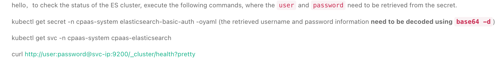

---
kind:
  - Troubleshooting
products:
  - Alauda Container Platform
  - Alauda DevOps
  - Alauda AI
  - Alauda Application Services
  - Alauda Service Mesh
  - Alauda Developer Portal
ProductsVersion:
  - 4.1.0,4.2.x
---
<!-- A type of document that involves encountering a fault, diagnosing it, performing root cause analysis, and providing solutions. -->

# Status of the ES cluster > 0

ES cluster status remains red (max by(cluster) (es_cluster_status) >0 returns 1) ERROR logs: [o.e.x.s.a.e.NativeUsersStore] security index is unavailable WARN logs: [o.e.x.s.a.AuthenticationService] Password authentication failed for GICwDgkj

## Cause
- Security index unavailability triggering authentication failures
- Insufficient memory resources leading to OOM
- Operator-controlled ResourcePatch (rpch) overriding manual adjustments

## Resolution
- Delete previous rpch (kubectl delete rpch rp-7hxmj)
- Re-apply ES resource modifications via updated rpch
- Ensure ES_JAVA_OPTS settings (-Xms5g -Xmx5g) and memory limits (10Gi) are consistent in StatefulSet

## [workaround]

## [Related Information]
**Screenshots**

- Environment: 3.14.1
- cpaas-elasticsearch StatefulSet
- rpch (ResourcePatch)
- elasticsearch-basic-auth Secret
- ES_JAVA_OPTS
- cpaas-kafka
- cpaas-zookeeper
- Component: 日志事件审计
- Page ID: 330466281
- Original Title: 基础架构-运维中心-日志事件审计-Status of the ES cluster > 0-1836
