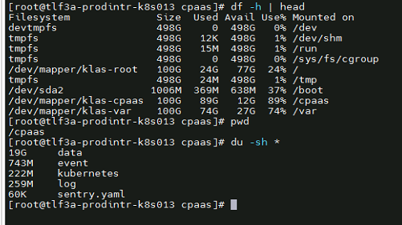
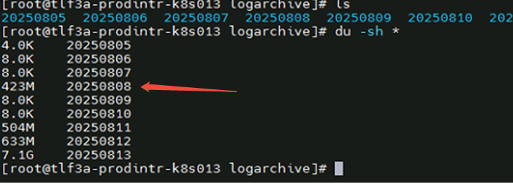
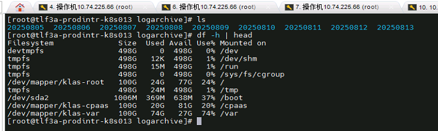
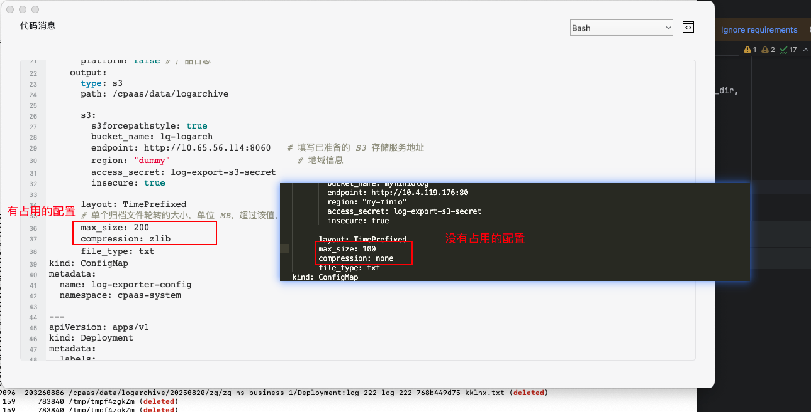

---
kind:
  - Troubleshooting
products:
  - Alauda Container Platform
  - Alauda DevOps
  - Alauda AI
  - Alauda Application Services
  - Alauda Service Mesh
  - Alauda Developer Portal
ProductsVersion:
  - 4.1.0,4.2.x
---
<!-- A type of document that involves encountering a fault, diagnosing it, performing root cause analysis, and providing solutions. -->

# 日志归档程序运行后，存储空间占用出现问题

df -h显示存储空间占用大，但du -sh *显示正常 lsof | grep delete显示/cpaas/data/logarchive下已删除文件被进程占用

## Cause
- 日志转存S3失败或进程卡住导致文件未释放
- compression配置项使用gzip时可能引发空间占用问题

## Resolution
- 重启log-exporter进程释放被锁空间
- 修改日志归档配置compression: none

## [workaround]

## [Related Information]
**Screenshots**

- Environment: 3.14.2
- /cpaas/data/logarchive
- log-exporter
- compression
- Component: 日志事件审计
- Page ID: 333316478
- Original Title: 基础架构-运维中心-日志事件审计-日志归档程序运行后，存储空间占用出现问题-115072
