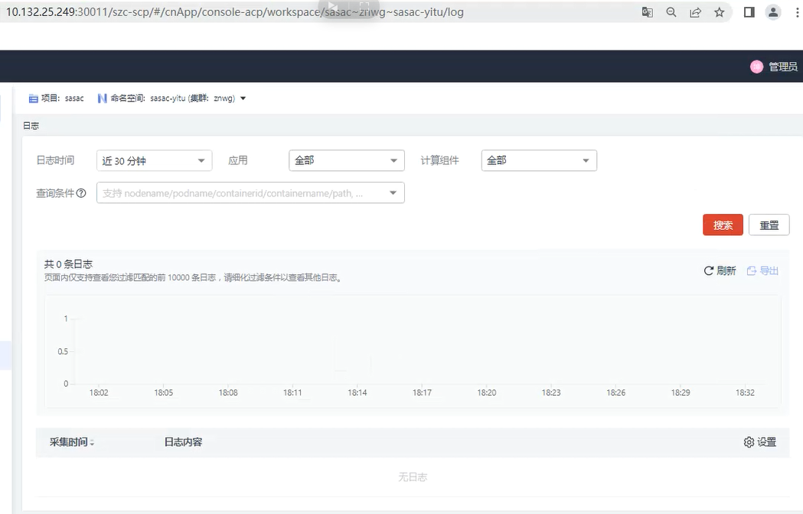

---
kind:
  - Troubleshooting
products:
  - Alauda Container Platform
  - Alauda DevOps
  - Alauda AI
  - Alauda Application Services
  - Alauda Service Mesh
  - Alauda Developer Portal
ProductsVersion:
  - 4.1.0,4.2.x
---
<!-- A type of document that involves encountering a fault, diagnosing it, performing root cause analysis, and providing solutions. -->

# 平台日志无法正常查看

平台日志无法正常查看 Elasticsearch集群状态异常 日志数据分片不可用

## Cause
- Elasticsearch分片处于不可用状态

## Resolution
- 执行Elasticsearch重新分片操作
- 删除不可恢复的分片

## [workaround]

## [Related Information]
**Screenshots**

- Environment: 3.12.0
- lanaya
- ela
- kafka
- zookeeper
- kubectl get pod -A -owide |grep -E 'lanaya|ela|kafka|zookeeper'
- Component: 日志事件审计
- Page ID: 333316781
- Original Title: 基础架构-运维中心-日志事件审计-平台日志无法正常查看-115702
