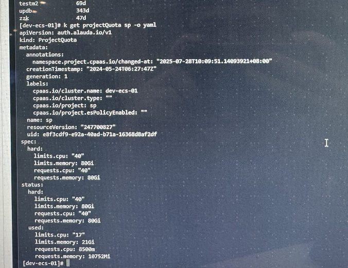

---
kind:
  - Troubleshooting
products:
  - Alauda Container Platform
  - Alauda DevOps
  - Alauda AI
  - Alauda Application Services
  - Alauda Service Mesh
  - Alauda Developer Portal
ProductsVersion:
  - 4.1.0,4.2.x
---
<!-- A type of document that involves encountering a fault, diagnosing it, performing root cause analysis, and providing solutions. -->

# acp平台中某个项目显示 错误

项目显示错误-113920 no matches for kind 'projectquota' in version 'auth.alauda.io/v1' 命名空间pods配额被更新后自动恢复默认值

## Cause
- auth-controller2跨集群client未watch到目标集群的projectquota资源

## Resolution
- 重启global环境的auth-controller2组件

## [workaround]

## [Related Information]
**Screenshots**

- Environment: 3.16.2
- projectquota
- auth.alauda.io/v1
- auth-controller2
- Component: 项目与权限
- Page ID: 324174122
- Original Title: 基础架构-项目与权限-项目-acp平台中某个项目显示 错误-113920
