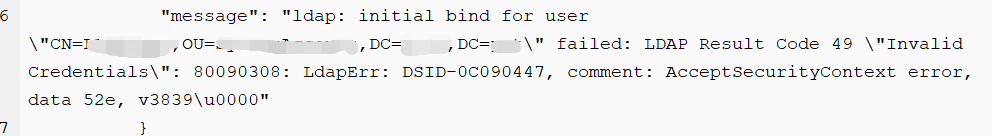
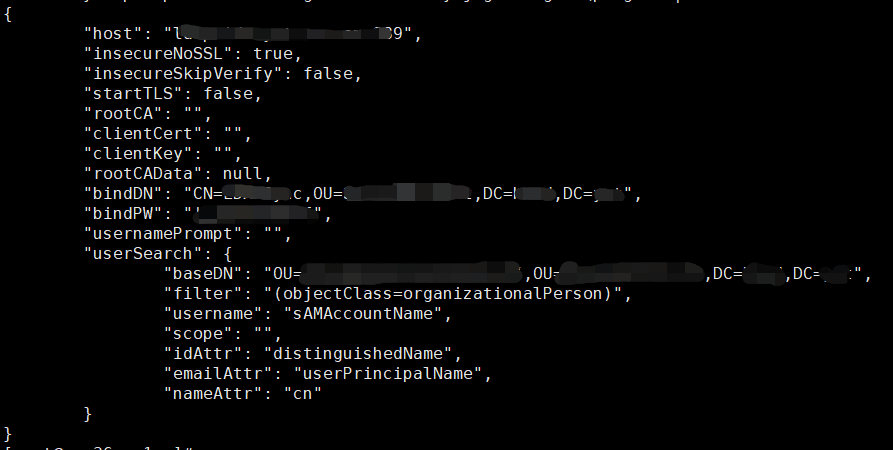

---
kind:
  - Troubleshooting
products:
  - Alauda Container Platform
  - Alauda DevOps
  - Alauda AI
  - Alauda Application Services
  - Alauda Service Mesh
  - Alauda Developer Portal
ProductsVersion:
  - 4.1.0,4.2.x
---
<!-- A type of document that involves encountering a fault, diagnosing it, performing root cause analysis, and providing solutions. -->

# 平台对接windows AD

failed: LDAP Result Code 49 "Invalid Credentials": 80090308: LdapErr: DSID-0C090447, comment: AcceptSecurityContext error, data 52e, v3839\u0000

## Cause
- 密码中包含 $ 符号被识别为环境变量导致传参错误
- bindDN 或搜索起点配置不正确

## Resolution
- 使用推荐的 Active Directory 配置表（用户对象类型为 organizationalPerson，登录字段为 sAMAccountName，搜索起点为 dc=example,dc=org 等）
- 处理密码中的特殊字符（如 $）避免被解析为环境变量
- 将 connector 配置转为 base64 后手动创建 connector.yaml（示例格式见文档）

## [workaround]
- 通过 base64 编码 config 文件绕过参数解析问题

## [Related Information]
**Screenshots**

- Environment: 版本 3.4.x、3.6.x；关键词：ldap windowsAD
- ldapsearch
- connector.yaml
- bindDN
- sAMAccountName
- distinguishedName
- userPrincipalName
- memberOf
- Component: 用户
- Page ID: 112053307
- Original Title: 平台对接windows AD
