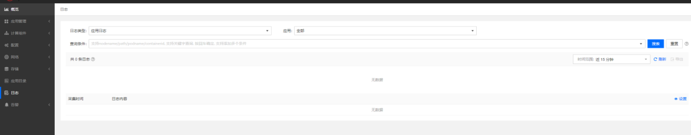
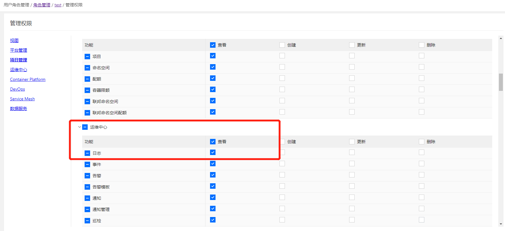

---
kind:
  - Troubleshooting
products:
  - Alauda Container Platform
  - Alauda DevOps
  - Alauda AI
  - Alauda Application Services
  - Alauda Service Mesh
  - Alauda Developer Portal
ProductsVersion:
  - 4.1.0,4.2.x
---
<!-- A type of document that involves encountering a fault, diagnosing it, performing root cause analysis, and providing solutions. -->

# 用户权限

日志页面提示无数据

## Cause
- 自定义角色缺少运维中心日志查看权限

## Resolution
- 创建角色时添加运维中心-日志-查看权限

## [workaround]

## [Related Information]
**Screenshots**

- Environment: 3.0.*,3.4.*,3.6.*
- 运维中心-日志
- Container Platform
- Component: 用户
- Page ID: 112064432
- Original Title: 用户权限-自定义角色业务视图日志查看无数据
