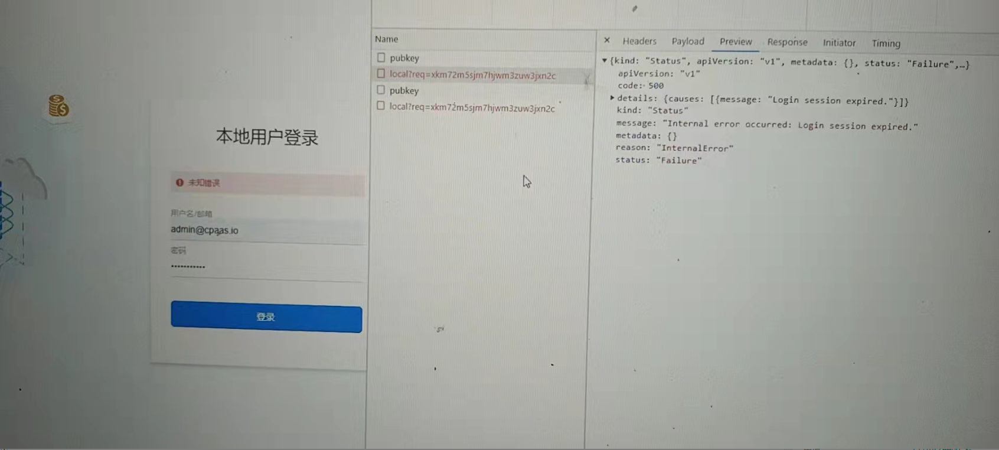

---
kind:
  - Troubleshooting
products:
  - Alauda Container Platform
  - Alauda DevOps
  - Alauda AI
  - Alauda Application Services
  - Alauda Service Mesh
  - Alauda Developer Portal
ProductsVersion:
  - 4.1.0,4.2.x
---
<!-- A type of document that involves encountering a fault, diagnosing it, performing root cause analysis, and providing solutions. -->

# 平台登录访问报未知错误

输入正确的用户名密码后报未知错误 UI界面地址与kubectl get authrequests -A 的req不一致

## Cause
- 浏览器缓存导致认证请求地址不一致

## Resolution
- 清理浏览器缓存后重新登录
- 直接使用访问地址登录

## [workaround]

## [Related Information]
**Screenshots**

- Environment: 3.x
- authrequests
- dex
- UI界面
- Component: 用户
- Page ID: 115512967
- Original Title: 平台登录访问报未知错误
