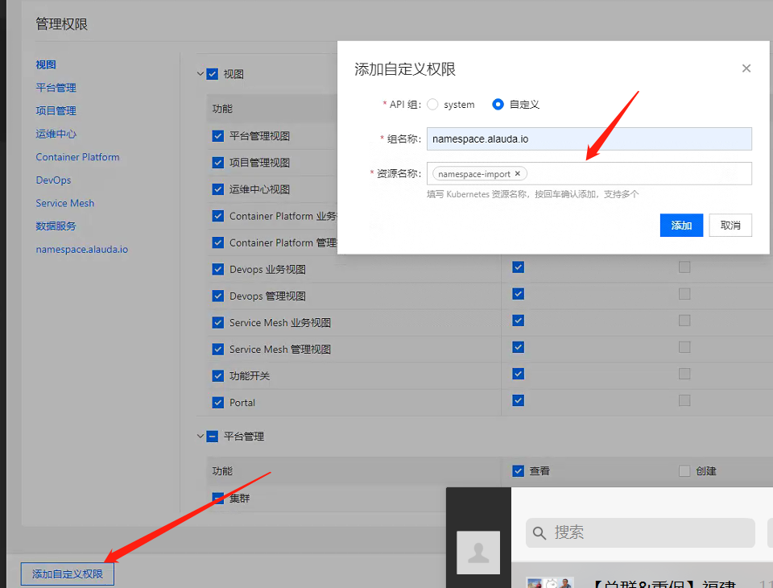
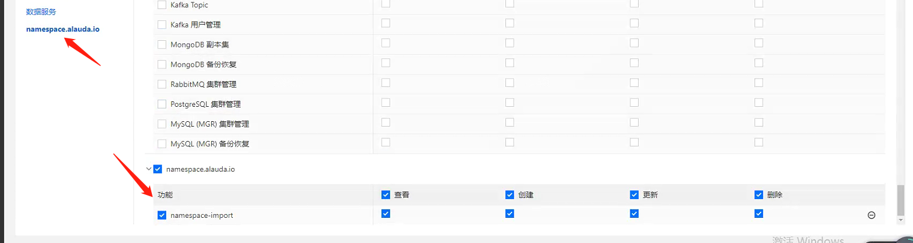

---
kind:
  - Troubleshooting
products:
  - Alauda Container Platform
  - Alauda DevOps
  - Alauda AI
  - Alauda Application Services
  - Alauda Service Mesh
  - Alauda Developer Portal
ProductsVersion:
  - 4.1.0,4.2.x
---
<!-- A type of document that involves encountering a fault, diagnosing it, performing root cause analysis, and providing solutions. -->

# 自定义角色，添加导入命名空间权限

无法为自定义角色添加导入命名空间权限

## Cause
- 3.8以下版本未预置导入命名空间权限资源项

## Resolution
- 创建角色时添加自定义资源并绑定用户

## [workaround]

## [Related Information]
**Screenshots**
您好，可在创建自定义角色的时候，添加自定义资源 如图：，然后给用户绑定该角色，就可以拥有导入命名空间的权限了。
- Environment: 3.8以下版本（特别是3.6X）
- 自定义角色配置
- 命名空间权限管理
- Component: 用户
- Page ID: 120096096
- Original Title: 自定义角色，添加导入命名空间权限
