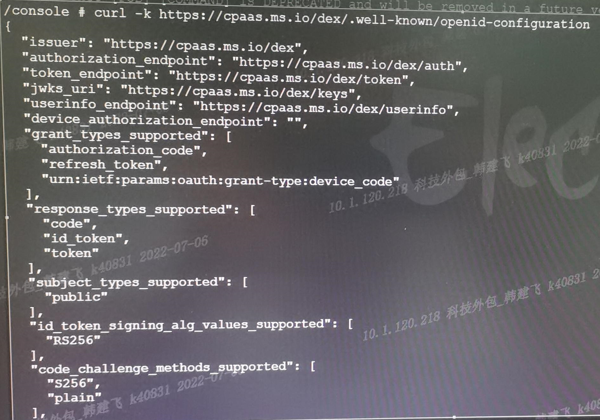
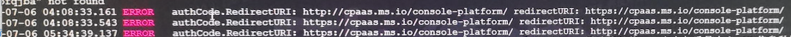

---
kind:
  - Troubleshooting
products:
  - Alauda Container Platform
  - Alauda DevOps
  - Alauda AI
  - Alauda Application Services
  - Alauda Service Mesh
  - Alauda Developer Portal
ProductsVersion:
  - 4.1.0,4.2.x
---
<!-- A type of document that involves encountering a fault, diagnosing it, performing root cause analysis, and providing solutions. -->

# 平台用户登录平台后平台界面偶现token超时报错

平台用户登录后界面偶现token超时报错

## Cause
- 多人共用账号导致redirectUri不一致
- 不同访问协议（如HTTP/HTTPS混合访问）引发问题

## Resolution
- 升级到3.9版本修复

## [workaround]
- 避免共用账号
- 仅开放HTTPS协议访问

## [Related Information]
**Screenshots**

- Environment: 3.8
- underlord服务
- dex服务
- oicd配置
- redirectUri
- cpaas.ms.io
- Component: 用户
- Page ID: 120096510
- Original Title: 平台用户登录平台后平台界面偶现token超时报错
