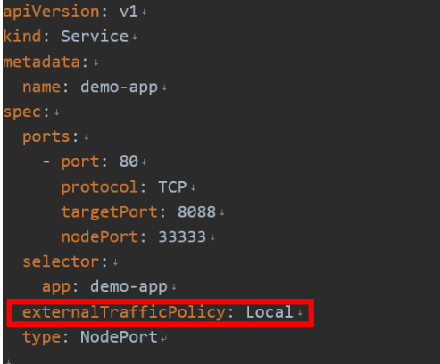

---
kind:
  - Troubleshooting
products:
  - Alauda Container Platform
  - Alauda DevOps
  - Alauda AI
  - Alauda Application Services
  - Alauda Service Mesh
  - Alauda Developer Portal
ProductsVersion:
  - 4.1.0,4.2.x
---
<!-- A type of document that involves encountering a fault, diagnosing it, performing root cause analysis, and providing solutions. -->

# calico

无法获取用户请求的真实IP地址

## Cause
- Service默认externalTrafficPolicy配置为Cluster模式导致SNAT

## Resolution
- 修改Service配置文件添加配置项：externalTrafficPolicy: Local

## [workaround]
- 客户端需直接访问Pod所在节点IP进行访问

## [Related Information]
**Screenshots**

- Environment: calico网络环境
- service.spec.externalTrafficPolicy
- NodePort
- kube-proxy
- Component: 用户
- Page ID: 120101975
- Original Title: 网络-calico-服务通过Nodeport暴露-如何获取用户请求的真实IP地址
