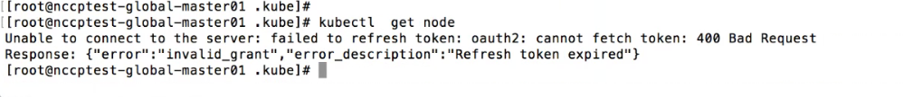

---
kind:
  - Troubleshooting
products:
  - Alauda Container Platform
  - Alauda DevOps
  - Alauda AI
  - Alauda Application Services
  - Alauda Service Mesh
  - Alauda Developer Portal
ProductsVersion:
  - 4.1.0,4.2.x
---
<!-- A type of document that involves encountering a fault, diagnosing it, performing root cause analysis, and providing solutions. -->

# cce环境后台没有kubectl权限

执行kubectl命令报权限错误

## Cause
- 未正确登录CCE平台

## Resolution
- 在节点上执行`cce login`，使用CCE平台admin用户密码认证

## [workaround]

## [Related Information]
**Screenshots**

- Environment: cce
- cce login
- kubectl
- admin用户凭证
- Component: 用户
- Page ID: 120113021
- Original Title: cce环境后台没有kubectl权限
