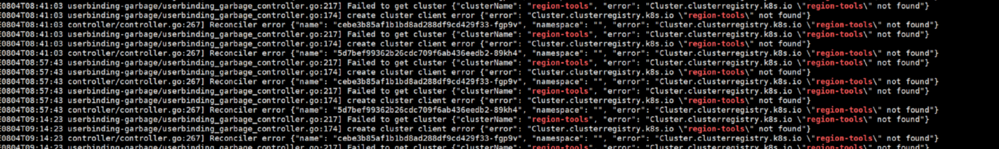

---
kind:
  - Troubleshooting
products:
  - Alauda Container Platform
  - Alauda DevOps
  - Alauda AI
  - Alauda Application Services
  - Alauda Service Mesh
  - Alauda Developer Portal
ProductsVersion:
  - 4.1.0,4.2.x
---
<!-- A type of document that involves encountering a fault, diagnosing it, performing root cause analysis, and providing solutions. -->

# auth

auth-controller2 找不存在的集群报错

## Cause
- 已删除集群存在残留的命名空间管理员权限绑定

## Resolution
- 通过命令 kubectl get userbinding -l 'cpaas.io/cluster=<已删除集群名称>,auth.cpaas.io/role.level=namespace' 查询并删除对应 userbinding 资源

## [workaround]

## [Related Information]
**Screenshots**

- Environment: 通用版本
- userbinding
- cpaas.io/cluster
- auth.cpaas.io/role.level=namespace
- Component: 用户
- Page ID: 120120315
- Original Title: auth-controller2找不存在的集群
