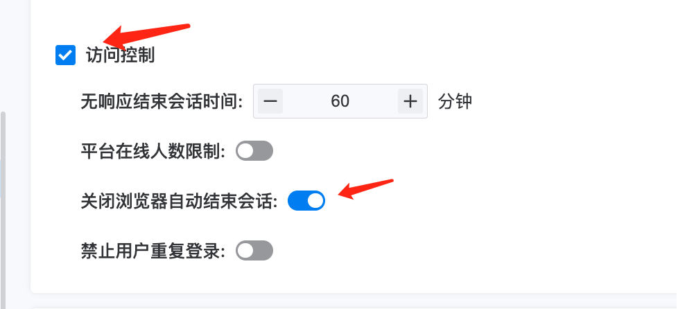

---
kind:
  - Troubleshooting
products:
  - Alauda Container Platform
  - Alauda DevOps
  - Alauda AI
  - Alauda Application Services
  - Alauda Service Mesh
  - Alauda Developer Portal
ProductsVersion:
  - 4.1.0,4.2.x
---
<!-- A type of document that involves encountering a fault, diagnosing it, performing root cause analysis, and providing solutions. -->

# admin账号登录异常

使用admin账号登录后出现异常提示：'长时间未操作或此账号在其他地方登录，请重新登录' session资源在60分钟未到被提前清理

## Cause
- TKE3.8.1新增安全需求导致账号退出时触发清理会话资源
- UserPolicy配置的600分钟无响应结束会话时间未生效

## Resolution
- 在访问控制中关闭浏览器自动结束会话功能
- 降级到TKE3.8.0版本使用会话功能

## [workaround]

## [Related Information]
**Screenshots**

- Environment: TKE3.8.1
- session资源
- userpolicy
- dex组件
- 心跳api
- apollo组件
- erebus
- Component: 用户
- Page ID: 127407438
- Original Title: admin账号登录异常
