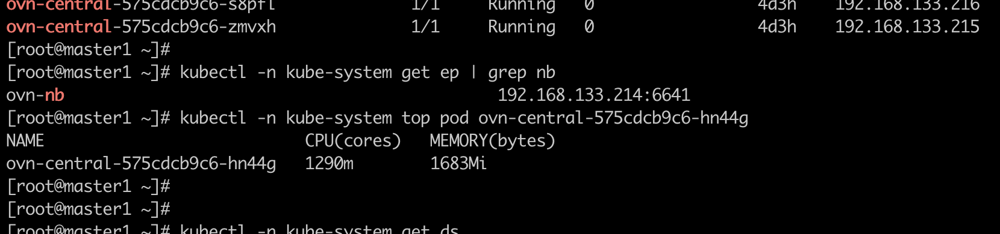
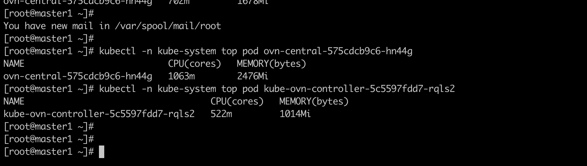
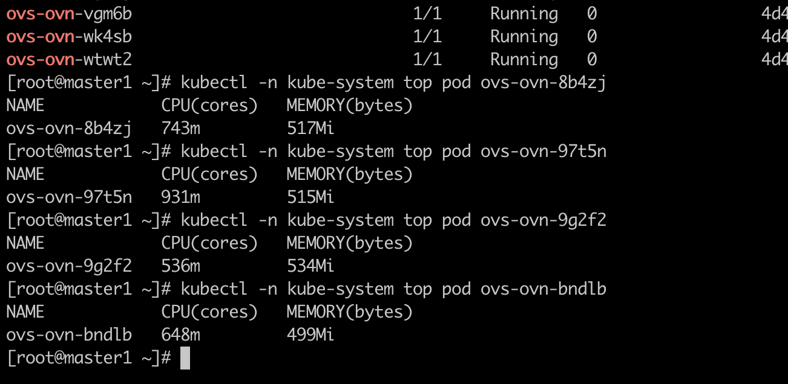

---
kind:
  - Troubleshooting
products:
  - Alauda Container Platform
  - Alauda DevOps
  - Alauda AI
  - Alauda Application Services
  - Alauda Service Mesh
  - Alauda Developer Portal
ProductsVersion:
  - 4.1.0,4.2.x
---
<!-- A type of document that involves encountering a fault, diagnosing it, performing root cause analysis, and providing solutions. -->

# 大规模集群部署 pod 起来得很慢

pod 启动缓慢 用户报告丢包和后端不通

## Cause
- ovs-ovn, ovn-controller, ovn-central 资源使用率达到极限
- ovs-ovn 的 CPU 使用已达 1u 极限

## Resolution
- 大幅提高所有组件的 request 和 limit 数量
- 关闭 LB

## [workaround]

## [Related Information]
**Screenshots**

- Environment: 大规模集群部署环境
- ovs-ovn
- ovn-controller
- ovn-central
- LB
- Component: 用户
- Page ID: 127410277
- Original Title: 大规模集群部署 pod 起来得很慢
