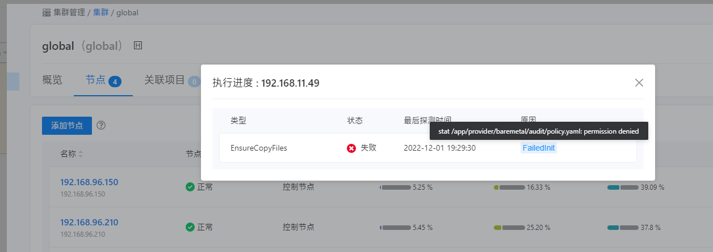
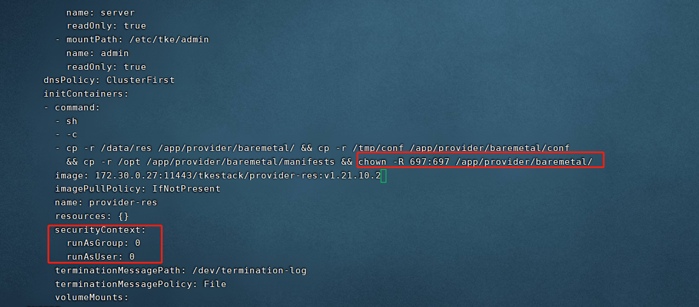

---
kind:
  - Troubleshooting
products:
  - Alauda Container Platform
  - Alauda DevOps
  - Alauda AI
  - Alauda Application Services
  - Alauda Service Mesh
  - Alauda Developer Portal
ProductsVersion:
  - 4.1.0,4.2.x
---
<!-- A type of document that involves encountering a fault, diagnosing it, performing root cause analysis, and providing solutions. -->

# 3.8.3

Ensurecopyfiles部分报错

## Cause
- tke-platform-controller的extra-res带入了root权限的文件，导致nonroot用户无权限执行

## Resolution
- 修改tke-platform-controller的Deployment，在initContainers中添加securityContext: runAsGroup:0, runAsUser:0

## [workaround]

## [Related Information]
**Screenshots**

- Environment: 3.8.3
- tke-platform-controller
- /data/res
- /app/provider/baremetal/
- /tmp/conf
- /opt
- Component: 用户
- Page ID: 130577364
- Original Title: 3.8.3-global集群节点添加报错-Ensurecopyfiles部分报错
