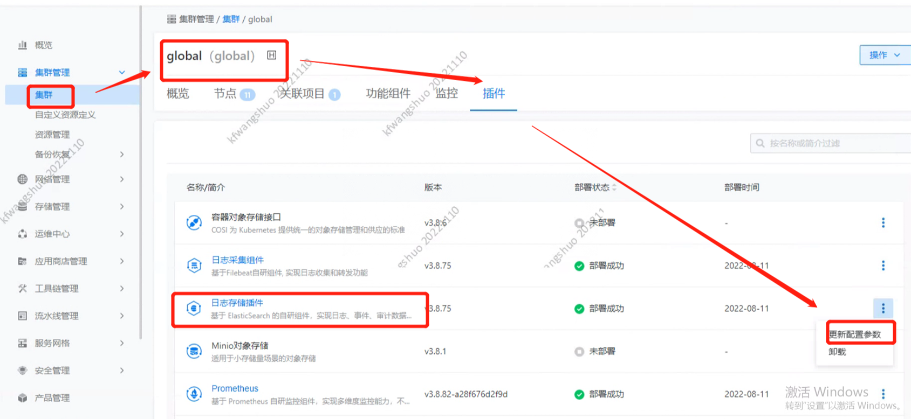
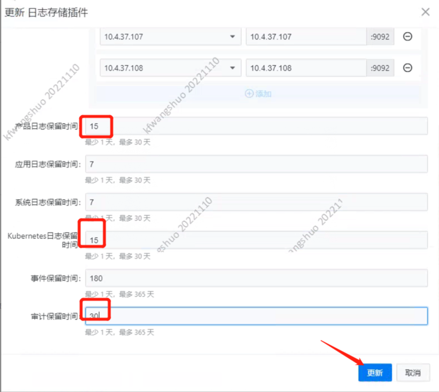

---
kind:
  - Troubleshooting
products:
  - Alauda Container Platform
  - Alauda DevOps
  - Alauda AI
  - Alauda Application Services
  - Alauda Service Mesh
  - Alauda Developer Portal
ProductsVersion:
  - 4.1.0,4.2.x
---
<!-- A type of document that involves encountering a fault, diagnosing it, performing root cause analysis, and providing solutions. -->

# 平台日志加载异常

平台日志加载异常 es存储使用到达100%导致日志数据无法写入

## Cause
- es存储使用率100%导致无法写入日志数据
- 无法进行磁盘扩容

## Resolution
- 执行命令获取es集群信息：kubectl get svc -A |grep ela
- 获取es凭证：kubectl get secret -ncpaas-system acp-config-secret -oyaml
- 检查索引状态：curl -XGET -u用户名:密码 svcip:9200/_cat/indices
- 手动清理索引：curl -XDELETE -u用户名:密码 svcip:9200/索引名称
- 调整日志保留策略：通过集群管理-插件管理更新日志保留设置

## [workaround]

## [Related Information]
**Screenshots**

- Environment: Kubernetes
- es集群
- 9200端口
- /_cat/indices
- acp-config-secret
- 日志保留策略配置
- Component: 用户
- Page ID: 133092044
- Original Title: 平台日志加载异常-es存储使用到达100%导致日志数据无法写入-在无法进行磁盘扩容的情况下-需要进行手动日志清理
