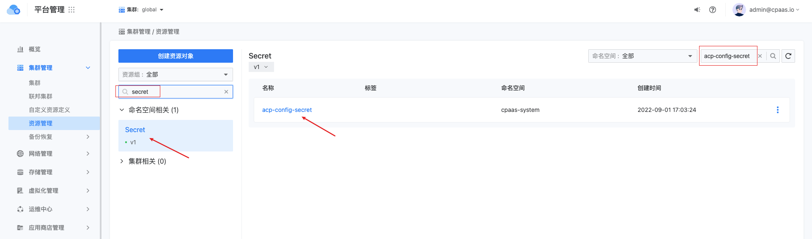
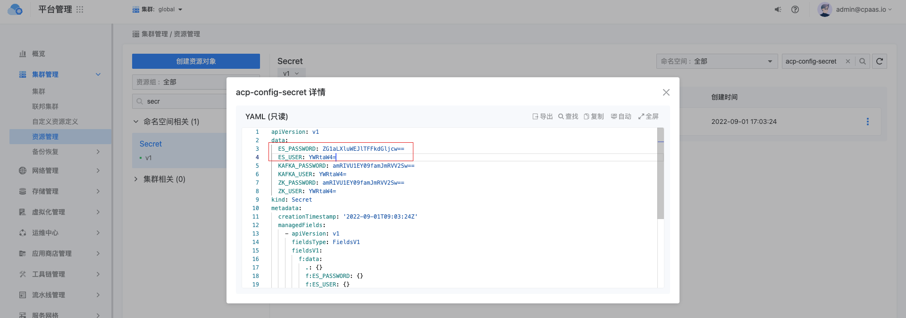

---
kind:
  - Troubleshooting
products:
  - Alauda Container Platform
  - Alauda DevOps
  - Alauda AI
  - Alauda Application Services
  - Alauda Service Mesh
  - Alauda Developer Portal
ProductsVersion:
  - 4.1.0,4.2.x
---
<!-- A type of document that involves encountering a fault, diagnosing it, performing root cause analysis, and providing solutions. -->

# 平台日志存储插件的kibana如何访问

## 环境信息 适用版本：3.8.1

## Cause

## Resolution
- 访问 http(s)://<平台访问地址>/console-platform/manage-platform/cluster/global/cluster-management/resource/list 获取acp-config-secret
- 从acp-config-secret的yaml中提取ES_USER和ES_PASSWORD并进行base64解码
- 通过 http(s)://<平台访问地址>/kibana 访问Kibana

## [workaround]

## [Related Information]
**Screenshots**

- Environment: 3.8.1
- acp-config-secret
- ES_USER
- ES_PASSWORD
- /kibana
- Component: 用户
- Page ID: 136542117
- Original Title: 平台日志存储插件的kibana如何访问
