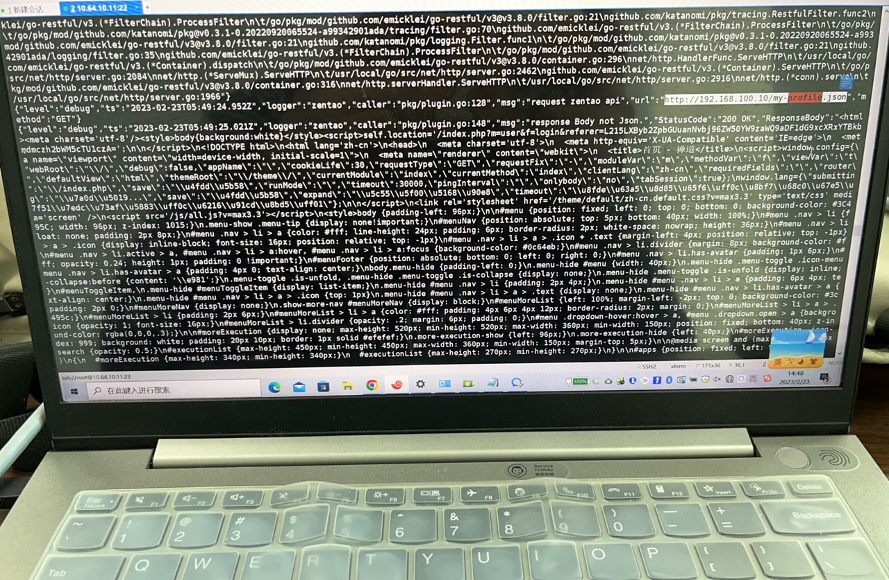
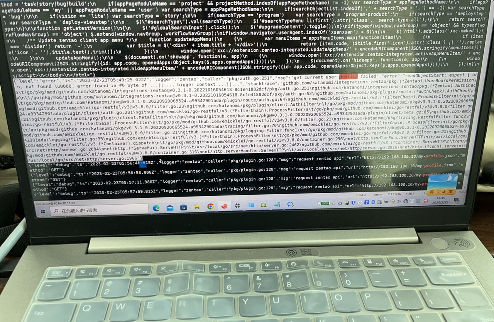
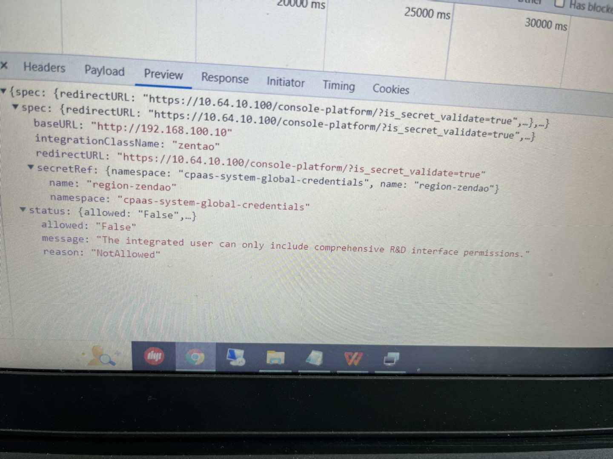

---
kind:
  - Troubleshooting
products:
  - Alauda Container Platform
  - Alauda DevOps
  - Alauda AI
  - Alauda Application Services
  - Alauda Service Mesh
  - Alauda Developer Portal
ProductsVersion:
  - 4.1.0,4.2.x
---
<!-- A type of document that involves encountering a fault, diagnosing it, performing root cause analysis, and providing solutions. -->

# 3.10.2

访问xxx.xxx.xx.x/my-profile.json返回HTML格式数据而非预期JSON 修改配置后页面集成报错变化

## Cause
- 使用admin用户进行集成操作

## Resolution
- 确保禅道配置正确并使用普通用户进行集成

## [workaround]

## [Related Information]
**Screenshots**

- Environment: 3.10.2
- /my-profile.json
- 禅道admin用户
- 普通用户
- Pod日志
- Component: 用户
- Page ID: 140824877
- Original Title: 3.10.2-DevOps-禅道v3.3版本集成报错
