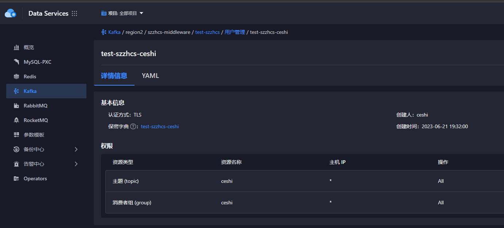
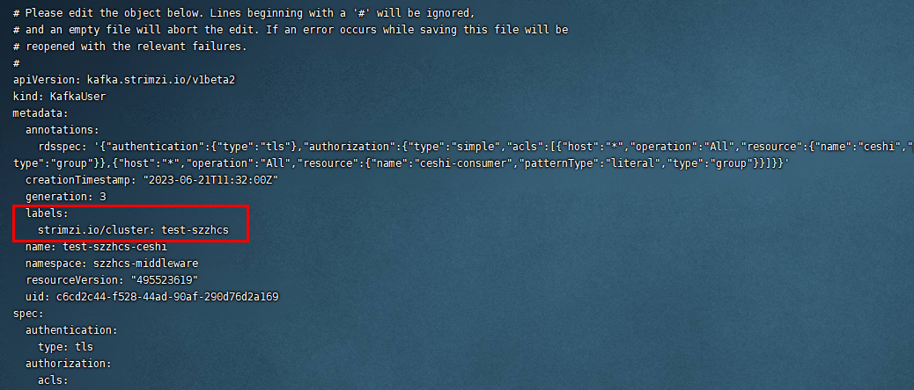

---
kind:
  - Troubleshooting
products:
  - Alauda Container Platform
  - Alauda DevOps
  - Alauda AI
  - Alauda Application Services
  - Alauda Service Mesh
  - Alauda Developer Portal
ProductsVersion:
  - 4.1.0,4.2.x
---
<!-- A type of document that involves encountering a fault, diagnosing it, performing root cause analysis, and providing solutions. -->

# 3.12.1kafka通过用户管理创建消费组失败

通过用户管理创建消费组失败 后台资源误删除导致消费者创建失败

## Cause
- 3.12.1版本存在bug，通过更新用户新增消费组资源时会误删后台资源

## Resolution
- kubectl get kafkauser -A | grep kafka用户名称
- kubectl edit kafkauser -n 命名空间 用户名称
- 在labels中添加middleware.alauda.io/cluster: test-szzhcs配置

## [workaround]

## [Related Information]
**Screenshots**

- Environment: 3.12.1
- kafkauser
- middleware.alauda.io/cluster
- kubectl
- Component: 用户
- Page ID: 151885943
- Original Title: 3.12.1kafka通过用户管理创建消费组失败
