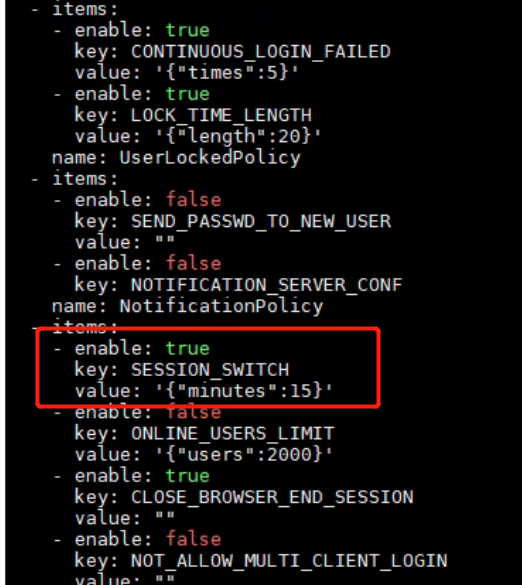
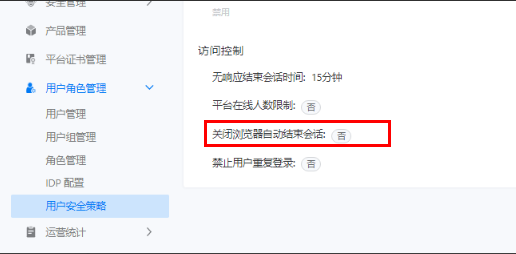

---
kind:
  - Troubleshooting
products:
  - Alauda Container Platform
  - Alauda DevOps
  - Alauda AI
  - Alauda Application Services
  - Alauda Service Mesh
  - Alauda Developer Portal
ProductsVersion:
  - 4.1.0,4.2.x
---
<!-- A type of document that involves encountering a fault, diagnosing it, performing root cause analysis, and providing solutions. -->

# 3.12.1

配置访问控制15分钟超时登出，实际5-10秒就登出

## Cause
- 平台用户安全策略中'关闭浏览器结束会话'配置与访问控制策略冲突

## Resolution
- 关闭用户安全策略的'关闭浏览器结束会话'配置

## [workaround]

## [Related Information]
**Screenshots**

- Environment: 3.12.1
- 用户安全策略
- 访问控制策略
- 关闭浏览器结束会话
- Component: 用户
- Page ID: 151886436
- Original Title: 3.12.1-对接客户oauth登录，配置访问控制15分钟超时登出，实际上5-10s就登出了
