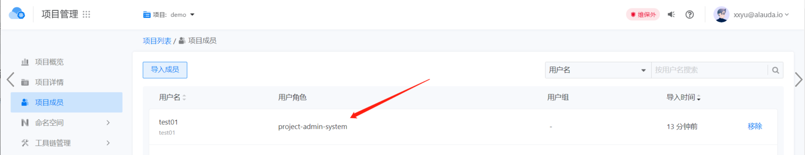

---
kind:
  - Troubleshooting
products:
  - Alauda Container Platform
  - Alauda DevOps
  - Alauda AI
  - Alauda Application Services
  - Alauda Service Mesh
  - Alauda Developer Portal
ProductsVersion:
  - 4.1.0,4.2.x
---
<!-- A type of document that involves encountering a fault, diagnosing it, performing root cause analysis, and providing solutions. -->

# 3.10.2

项目管理员用户查看Data Services页面无权限访问 通过项目导入成员后数据服务界面不显示ns

## Cause
- AIT功能bug导致通过项目导入成员时权限分配异常

## Resolution
- 升级到修复版本3.10.3

## [workaround]
- 直接通过用户管理界面赋予用户角色

## [Related Information]
**Screenshots**

- Environment: 3.10.2
- 项目成员导入功能
- 角色分配机制
- AIT功能模块
- Component: 用户
- Page ID: 152658622
- Original Title: 3.10.2-项目管理员用户查看Data Services 页面无权限访问
