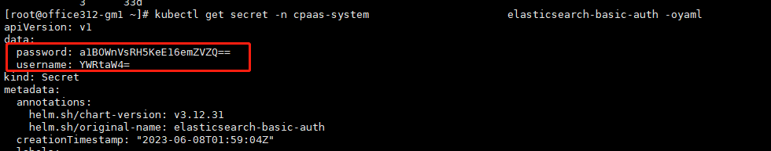

---
kind:
  - Troubleshooting
products:
  - Alauda Container Platform
  - Alauda DevOps
  - Alauda AI
  - Alauda Application Services
  - Alauda Service Mesh
  - Alauda Developer Portal
ProductsVersion:
  - 4.1.0,4.2.x
---
<!-- A type of document that involves encountering a fault, diagnosing it, performing root cause analysis, and providing solutions. -->

# 3.12 平台kibana访问方式

JIRA Jira：

## Cause

## Resolution
- 访问URL: https://<平台访问地址>/clusters/<集群名>/kibana
- 获取用户名密码: kubectl get secret -n cpaas-system elasticsearch-basic-auth -oyaml，解码password和username字段

## [workaround]

## [Related Information]
**Screenshots**

- Environment: 3.12.1
- elasticsearch-basic-auth
- cpaas-system
- /clusters/<集群名>/kibana
- kubectl get secret
- Component: 用户
- Page ID: 155327686
- Original Title: 3.12 平台kibana访问方式
