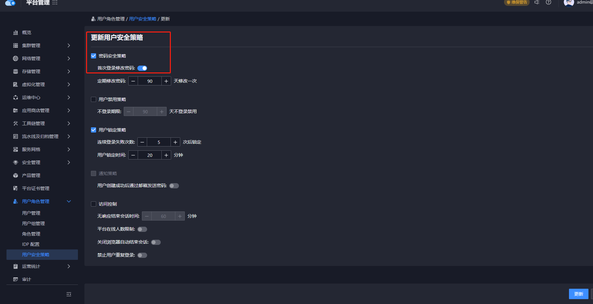

---
kind:
  - Troubleshooting
products:
  - Alauda Container Platform
  - Alauda DevOps
  - Alauda AI
  - Alauda Application Services
  - Alauda Service Mesh
  - Alauda Developer Portal
ProductsVersion:
  - 4.1.0,4.2.x
---
<!-- A type of document that involves encountering a fault, diagnosing it, performing root cause analysis, and providing solutions. -->

# 3.8创建用户名 支持_下划线

JIRA Jira：

## Cause
- 用户安全策略未配置允许带下划线的用户名

## Resolution
- 编辑用户安全策略启用首次登录修改密码
- 创建用户时设置密码为 admin@123
- 通过后台获取用户 password 的 YAML 文件并用 kubectl creat -f 创建

## [workaround]

## [Related Information]
**Screenshots**
1.编辑用户安全策略，打开首次登录修改密码
.

- Environment: 3.8
- 用户安全策略
- kubectl
- YAML 配置文件
- password
- Component: 用户
- Page ID: 170362990
- Original Title: 3.8创建用户名 支持_下划线
