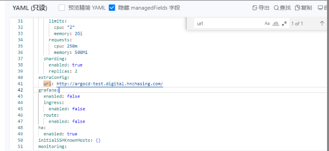

---
kind:
  - Troubleshooting
products:
  - Alauda Container Platform
  - Alauda DevOps
  - Alauda AI
  - Alauda Application Services
  - Alauda Service Mesh
  - Alauda Developer Portal
ProductsVersion:
  - 4.1.0,4.2.x
---
<!-- A type of document that involves encountering a fault, diagnosing it, performing root cause analysis, and providing solutions. -->

# ACP3.14.0 插件部署argocd应用登录用户未生效

登录用户后返回应用首页，登录未生效

## Cause
- argocd CR缺少extraurl和.server.insecure配置
- 内部路由后端服务未正确选择80端口
- 入站规则未设置HTTP协议

## Resolution
- 在argocd CR添加extraurl参数指定访问地址，并配置.server.insecure
- 调整内部路由配置指向80端口
- 修改入站规则后端服务协议为HTTP

## [workaround]

## [Related Information]
**Screenshots**

- Environment: ACP3.14+
- argocd CR
- extraurl
- .server.insecure
- 内部路由配置
- 入站规则
- 80端口
- Component: 用户
- Page ID: 182454255
- Original Title: ACP3.14.0 插件部署argocd应用登录用户未生效
