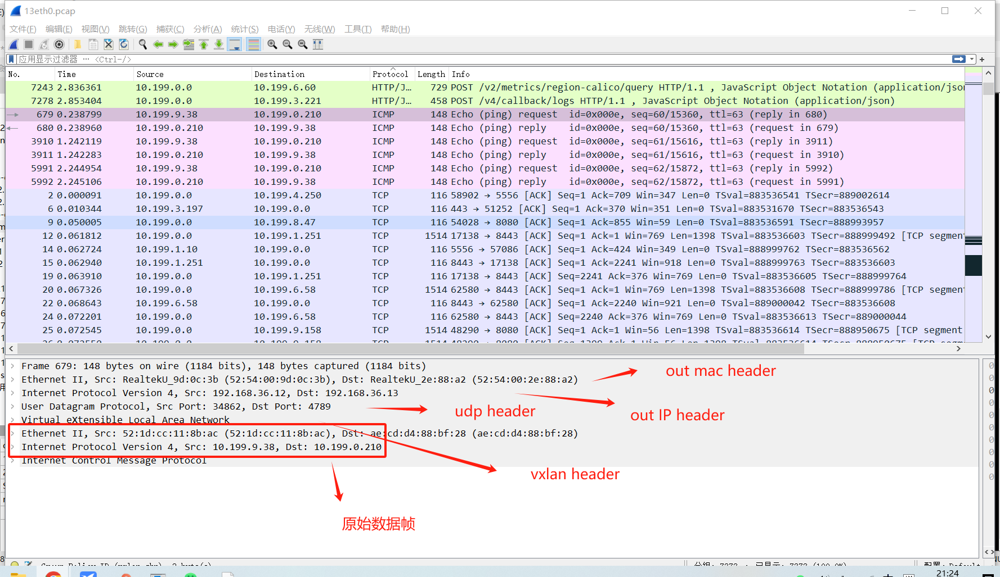

---
kind:
  - Troubleshooting
products:
  - Alauda Container Platform
  - Alauda DevOps
  - Alauda AI
  - Alauda Application Services
  - Alauda Service Mesh
  - Alauda Developer Portal
ProductsVersion:
  - 4.1.0,4.2.x
---
<!-- A type of document that involves encountering a fault, diagnosing it, performing root cause analysis, and providing solutions. -->

# Flannel 网络cni vxlan模式跨节点pod通信

跨节点pod通信异常 抓包显示VXLAN封装/解包异常 VXLAN外层IP/MAC地址不正确

## Cause
- VTEP设备IP/MAC配置错误
- VNI配置不一致
- 节点间UDP 4789端口不通
- flannel设备未正确处理封装
- 节点路由表缺失

## Resolution
- 检查VTEP的Outer Src/Dst IP配置
- 确认两端VNI字段一致
- 开放节点间4789/UDP端口
- 验证flannel.xxxx设备状态
- 核对节点路由表指向flannel设备

## [workaround]

## [Related Information]
**Screenshots**
****

且观察其以太帧源、目的地址未进行封装。

- Environment: Flannel网络 cni 跨节点pod通信
- flannel.4096
- cni0
- 4789/UDP
- VXLAN Header
- VNI
- VTEP
- 节点路由表
- Component: 用户
- Page ID: 198258192
- Original Title: Flannel 网络cni vxlan模式跨节点pod通信
