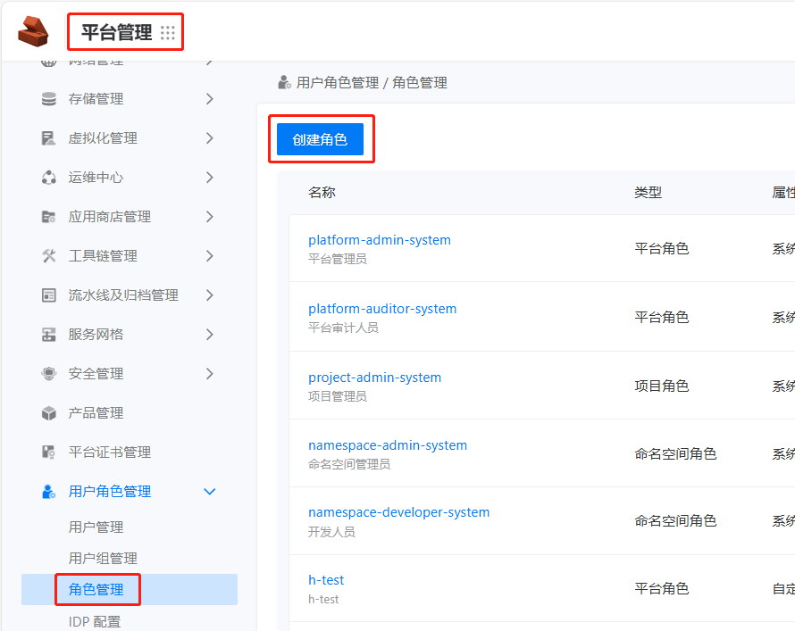
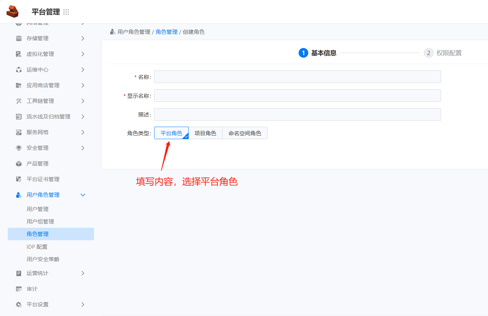
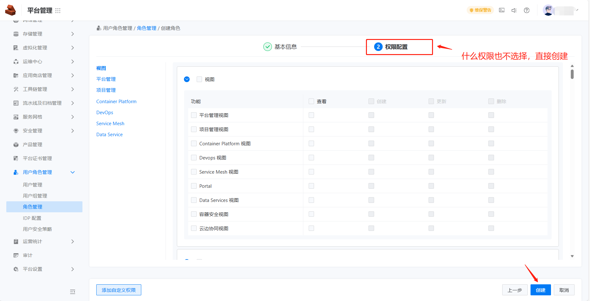
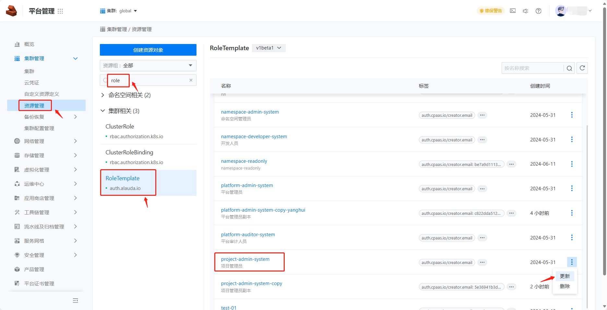
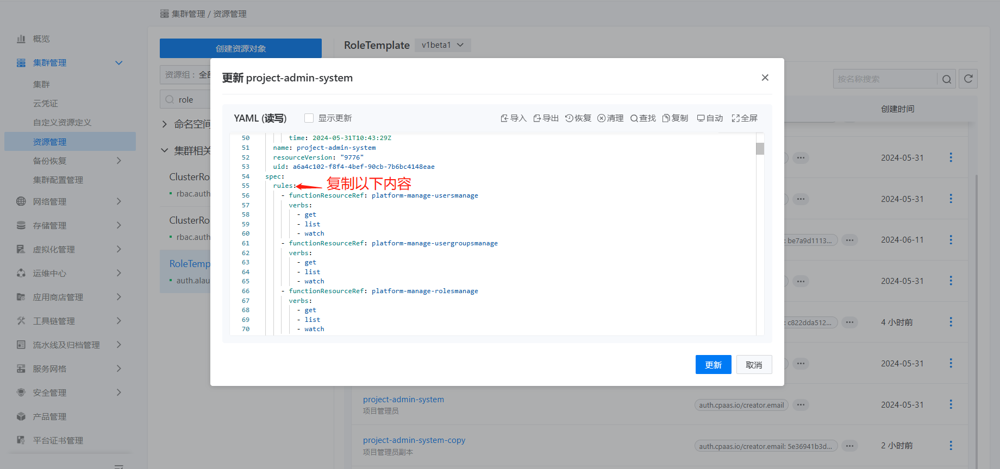
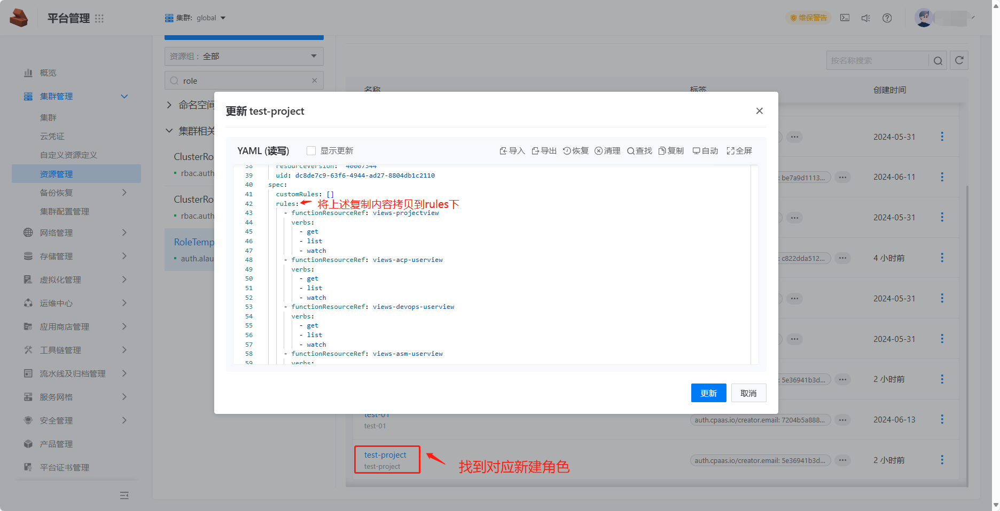
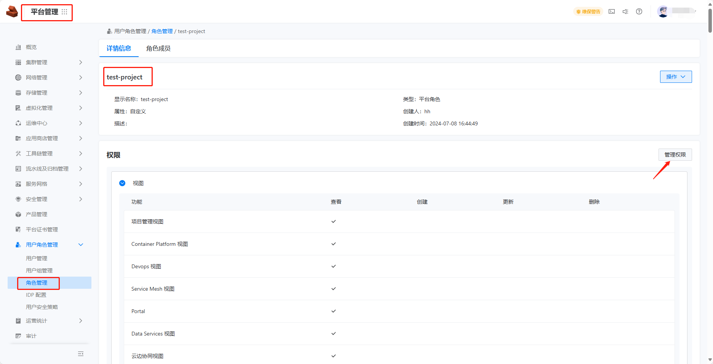
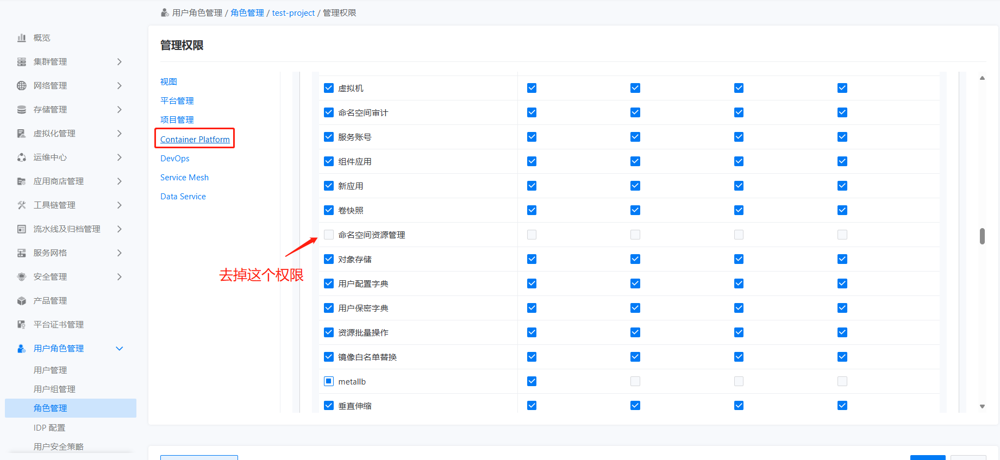
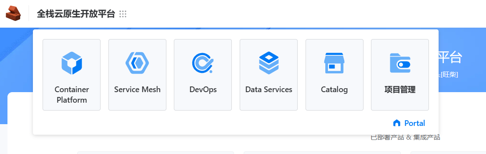

---
kind:
  - Troubleshooting
products:
  - Alauda Container Platform
  - Alauda DevOps
  - Alauda AI
  - Alauda Application Services
  - Alauda Service Mesh
  - Alauda Developer Portal
ProductsVersion:
  - 4.1.0,4.2.x
---
<!-- A type of document that involves encountering a fault, diagnosing it, performing root cause analysis, and providing solutions. -->

# 多项目管理角色创建

JIRA Jira：

## Cause

## Resolution
- 创建无权限平台角色，在 global 资源管理拷贝系统项目管理员规则
- 移除 Container Platform 下的命名空间资源管理权限
- 分配角色并验证权限

## [workaround]

## [Related Information]
**Screenshots**

- Environment: 3.6.1
- global 资源管理
- 系统项目管理员规则
- 平台角色管理界面
- Container Platform
- 命名空间资源管理权限
- Component: 用户
- Page ID: 225970531
- Original Title: 基础架构-多项目管理角色创建
