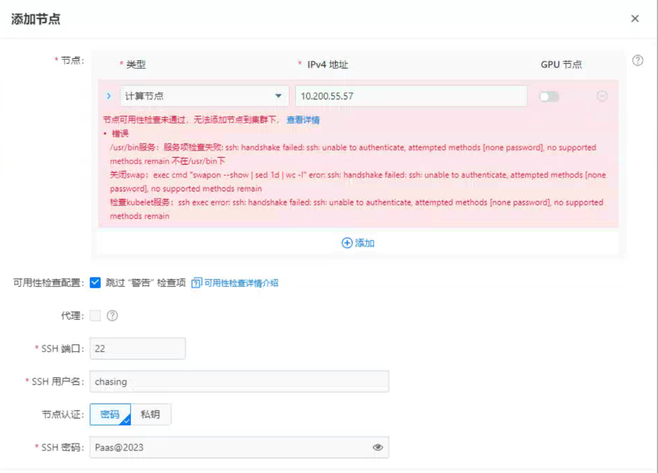
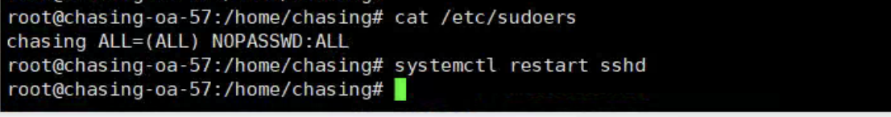
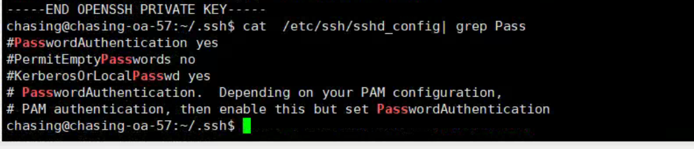
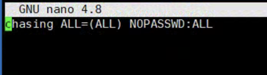
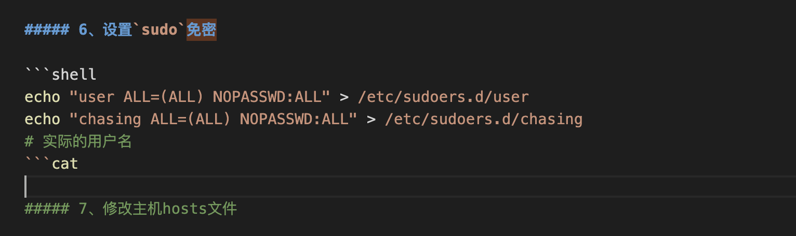

---
kind:
  - Troubleshooting
products:
  - Alauda Container Platform
  - Alauda DevOps
  - Alauda AI
  - Alauda Application Services
  - Alauda Service Mesh
  - Alauda Developer Portal
ProductsVersion:
  - 4.1.0,4.2.x
---
<!-- A type of document that involves encountering a fault, diagnosing it, performing root cause analysis, and providing solutions. -->

# 新增集群节点使用非root用户添加失败报错

ssh: handshake failed: ssh: unable to authenticate, attempted methods [none password], no supported methods remain

## Cause
- /etc/sudoers.d 目录主文件被错误命令清空，导致 sudo 配置缺失

## Resolution
- 还原 /etc/sudoers.d 备份配置，重新执行正确免密设置命令

## [workaround]

## [Related Information]
**Screenshots**

- Environment: 3.14.2
- /etc/sudoers.d
- /etc/ssh/sshd_config
- PasswordAuthentication
- sudo visudo
- sshd 服务
- Component: 用户
- Page ID: 227249195
- Original Title: 新增集群节点使用非root用户添加失败报错- ssh: handshake failed: ssh: unable to authenticate, attempted methods [none password], no supported methods remain
