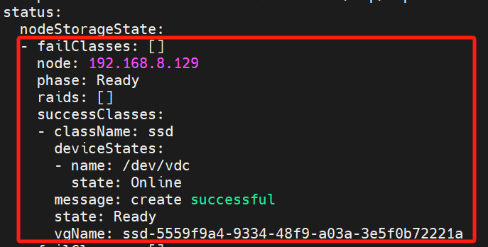

---
kind:
  - Troubleshooting
products:
  - Alauda Container Platform
  - Alauda DevOps
  - Alauda AI
  - Alauda Application Services
  - Alauda Service Mesh
  - Alauda Developer Portal
ProductsVersion:
  - 4.1.0,4.2.x
---
<!-- A type of document that involves encountering a fault, diagnosing it, performing root cause analysis, and providing solutions. -->

# topolvm移除节点后仍存在job资源：topolvm

kubectl delete topolvm-prepare-vg对应的job与pod资源会自动重启 手动删除topolvmcluster对应节点的status字段下的内容会自动恢复

## Cause
- status字段由Kubernetes系统自动维护，用户无法直接编辑

## Resolution
- 使用kubectl-edit-status工具编辑topolvmcluster资源
- 删除已移除节点在status字段的记录
- 重启topolvm-operator pod
- 手动删除残留的job资源：kubectl get job -n nativestor-system |grep topolvm

## [workaround]

## [Related Information]
**Screenshots**

- Environment: 通用
- topolvm-prepare-vg
- topolvmcluster
- status字段
- nativestor-system
- topolvm-operator
- Component: 用户
- Page ID: 229836991
- Original Title: topolvm移除节点后仍存在job资源：topolvm-prepare-vg
